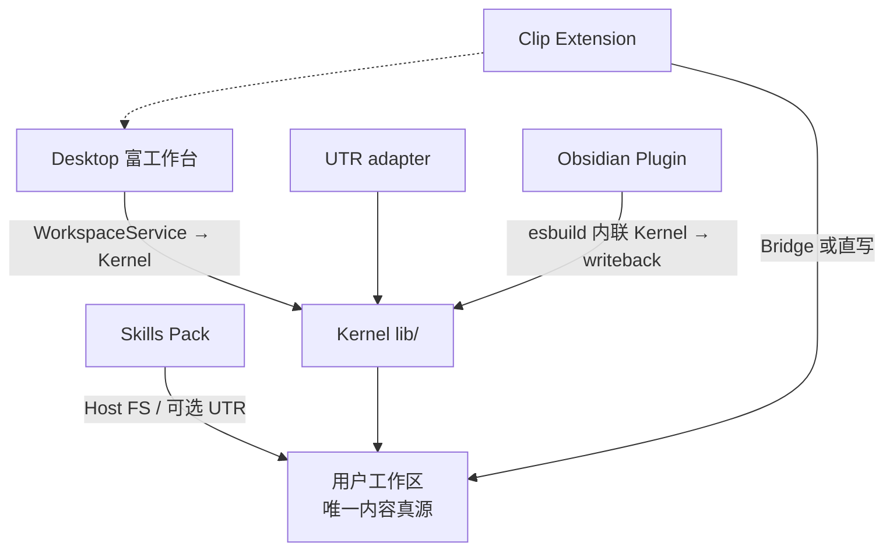

# PRODUCT-BOUNDARIES.md — 产品边界

> **边界唯一真源**。与 `PROJECT-MODEL.md`（内容约定）并列；实现与文档冲突时以二者为准。  
> **实施与诚实状态**：`docs/ARCHITECTURE-RESET.md`（决策锁 · Target vs Done）。

---

## 1. 第一性原理

```text
唯一内容真源 = 用户工作区文件系统（topmind.yaml + 内容/语义/系统三平面目录模型）
```

**北极星**：**最低摩擦个人动态流** — 记下来尽可能简单；持续维护交给 AI **建议**（用户确认后执行）；找回尽可能自然。

topmind 是 Agent 时代的本地优先工作台，按需组合四条独立能力，非强耦合单体：

| 模块 | 是什么 | 不是什么 |
|------|--------|----------|
| **Skills Pack** | 可独立安装在任意 Agent 上的流程与技能包 | 不是 Desktop 的专属插件 |
| **Desktop** | **富工作台**：浏览、深度编辑、捕获、AI 副驾、恢复、可扩展 | 不是必需前置壳；也不是薄聊天壳 |
| **UTR** | 可选 CLI / MCP（Kernel 的 adapter） | 不是 Desktop 或 Skills 的强制依赖；不是第三套业务实现 |
| **Obsidian Plugin** | Obsidian 内嵌动态流工作台 + AI 副驾 | 不是 Desktop 替代品；不是 Obsidian 编辑器重建 |

**共享**：

1. 内容约定（`PROJECT-MODEL.md`：三平面、`topic.md`、Frontmatter、6 条规约）
2. 行为契约（`topmind.yaml`：保护/生命周期/记忆/写回/Ingest/Agent 等）
3. 工作流语言（`收进来 -> 继续做 -> 交付/沉淀 -> 找回/调整`）
4. 写回伦理（可逆备份、路径回执、`writeback.mode` auto|confirm、open/locked protection）
5. **用户概念 ≤5**：记一下 · 动态 · 专题 · 我的情况 · 写出来

**不共享**：运行时进程、IPC、store、强制 tool 调用链。对比：[`docs/topmind-vs-others.md`](./docs/topmind-vs-others.md)。

---

## 2. 三平面与 Kernel

### 三平面隔离

1. **内容平面**：`{NN-名称}/` — 用户可见数据（收件箱、动态、专题、输出、归档）
2. **语义平面**：`memory/` — 固化英文名；`profile.md` / `periodic/` / `topics/`
3. **系统平面**：`topmind.yaml` + `.topmind/`（index/loop/logs，可删可重建）

### Kernel 八引擎（目标：唯一领域逻辑）

| 引擎 | 职责 | 实现状态（诚实） |
|------|------|------------------|
| contract-engine | 规约加载/校验/迁移/求值 | **Done 主路径** — 写闸/model/suggest/lifecycle 加载；**Intentional Partial** 非全 Surface 契约 UI |
| workspace-model | 类别/专题/路径 | **Done** — Desktop/UTR 共用 |
| stream-engine | 周期本/reconcile + **活动窗口** | **Done** — packing · reconcile · `activity-window`（suggest/todo/ops 共用）· 条目增补 |
| memory-engine | 分层记忆/提升物理操作 | **Done** — profile + **periodic**；建议 apply；**非**专题默认落点（专题在内容大类） |
| lifecycle-engine | 归档/清理/回顾扫描 | **Done** — scan→建议条；确认 apply 经 `executeArchive` 写闸 |
| writeback-engine | 保护/影子/回执/备份（**唯一写闸**） | **Done** — Desktop 主写 + UTR + AI `actor:"ai"` 经 Kernel；settings confirm 覆盖 gate；备份/回执仅高影响（locked 覆盖 · delete/archive · `BACKUP_KEEP=3`/`RECEIPT_KEEP=50` · `permanent` 彻底删除） |
| derived-builder | `.derived/` 生成重建 | **Done 最小** — topic summary + **item-history**；AI 摘要可占位 |
| ingest-pipeline | URL/文档路由语义 | **Done** 路由 — Desktop commit 经 `resolveIngestRoute`；转换器仍本地 |

**铁律（目标）**：Surface 不得平行实现业务语义。现状见 `docs/ARCHITECTURE-RESET.md` §2。

---

## 3. 边界判定

| 命题 | 结论 |
|------|------|
| Desktop 必须调 UTR 才能保存 / 捕获 / AI 写回？ | **否** — WorkspaceService → Kernel writeback-engine |
| Skills 必须调 UTR？ | **否** — Host 文件工具 + 内容约定 |
| 全部 UTR 命令日常必需？ | **否** — 注册表 25，MCP 默认 17 |
| 无 UTR 时是否可用？ | **是** |
| 保留 UTR 的理由？ | Agent Host / CI / doctor / 脚本的确定性命令面（Kernel adapter） |

### Desktop 是否捆绑 UTR？

| 问题 | 结论 |
|------|------|
| 安装包是否含 `utr/`？ | **是**（Tools / doctor / CLI 对齐） |
| 日常编辑 / AI 写回是否强制走 UTR？ | **否** |
| Skills pack 是否含 UTR？ | **否** |

### 本机持久化

```text
~/topmind/
├── topmind-workspace/     # 内容真源
└── topmind-desktop/       # Desktop runtime（settings / plugins / skills-extra / logs）
```

原则：**内容**与 **runtime** 分离。

---

## 4. 四体职责

### 4.1 Skills Pack

```text
topmind (router)
  ├── capture / organize / write / memory / maintain / loop
  └── optional connectors: weread / x
```

- 纯 Markdown + `topmind-pack.json`
- 执行面：Host 文件工具 → 可选 UTR → 对话建议
- 禁止把 Desktop 会话状态当内容真源

### 4.2 Desktop（富工作台）

```text
Shell = 变薄导航 + 深度编辑区 + AI 副驾
数据 = WorkspaceService →（目标）Kernel
AI = skill-first · 领域工具 · 建议条 + 确认执行
UTR = 软探测；写回不经 UTR
```

**必须独立完成**：工作区与 4 模板初始化、导航与编辑、捕获、知识加工、带原生工具的 AI、健康巡检入口。

**产品形态（Reset B）**：

- **富**：Tiptap 阅读/写作、多视图（二级）、插件槽、Clip、连接器
- **薄**：默认主表面 = 动态；用户概念 ≤5；标签/看板/Tools 不进主 chrome
- **AI 内生**：默认上下文感知；建议默认生成、高影响须确认（Reset D）

**Clip companion 分发面**（非第五「体」）：`browser-extension/`（MV3 剪藏）。经 Bridge 写入 Desktop 工作区；不单独实现 Kernel 业务语义。版本矩阵与四体并列，见根 `README.md`。

### 4.3 UTR

面向无 Desktop、有 agent/脚本的确定性命令面。

- **8 域 / 25 命令**；MCP 默认 **17**
- 完整表：`TOOLS.md`
- 目标：薄 adapter，业务在 Kernel

### 4.4 Obsidian Plugin（可选）

面向已使用 Obsidian 的用户，在 Vault 内嵌 topmind 动态流。

- 复用 Kernel `lib/` 八引擎（esbuild 打包内联）
- `require('fs')` 直访文件系统（Electron 渲染进程）
- `fetch` API 直调 AI（不引入 AI SDK）
- 详见 `obsidian-plugin/ARCHITECTURE.md` · ADR `docs/adr/2026-08-07-obsidian-plugin-architecture.md`

---

## 5. 边界拓扑



---

## 6. 版本层

版本数字**只**维护在真源文件；`npm run versions`。

**独立版本策略**：各表面有独立版本号，大版本对齐，小版本独立。详见 `AGENTS.md` §版本层。

| 层 | 真源文件 | 策略 |
|----|----------|------|
| Skills Pack | `skills/topmind-pack.json` | 独立 |
| Desktop | `topmind-desktop/package.json` | 独立 |
| Clip Extension | `browser-extension/manifest.json` | 独立 |
| UTR（可选） | `utr/VERSION` | 跟随 Desktop |
| Obsidian Plugin | `obsidian-plugin/manifest.json` | 独立 |

---

## 7. 用户心智（对外）

- **topmind**：本地优先的最低摩擦「个人动态流 + 轻量持续记忆」— 记简单，建议交给 AI，你确认，文件是你的。
- **Skills**：装进 AI 助手，按契约整理与写回。
- **Desktop**：富工作台；导航清晰；AI 是副驾不是喧宾夺主的聊天站。
- **UTR**（可选）：CLI/MCP；没有它，Skills 与 Desktop 仍可用。

---

## 8. 能力诚实表（摘要）

| 能力 | 状态 |
|------|------|
| 捕获 / 周期本 / 编辑 / 剪藏 / 文档加工 | **Done**（抓取网页图片本地化到 `images/{slug}/`） |
| skill-first AI 对话与领域工具 | **Done**（副驾建议条 + 待确认写入 **Done**） |
| 三平面目录与 topmind.yaml v4 | **Done**（约定）/ 契约 UI 非强制 **Intentional Partial** |
| writeback 唯一写闸 | **Done**（主路径 + confirm Model B + 高影响 only 备份/回执：locked 覆盖 · delete/archive · `permanent` 无副本） |
| Memory 产品面（我的情况 / 建议条） | **Done** |
| 主动建议 + 确认执行 | **Done**（high-impact 须 `confirmed:true`；自动准备可关；AI 建议变更检测 `lastAnalyzedHash`；`promote_memory` 真实 AI 提取非占位符） |
| 写出来 / publishPath | **Done**（副本 + `published_at`；发布后打开交付件；Outputs 复制正文 / HTML 导出） |
| 整理本周 / 任务面板 | **Done**（reconcile + ai_digest 任务 + 建议条候选确认；KanbanView 拖拽看板 + ViewSwitcher 多视图；digest/promote/archive 不造假任务按钮） |
| 动态主表面内容 | **Done**（周期解析含结构节软提取；无当前本回退列表；内联记一下 + 整理本周） |
| Desktop 响应式 chrome | **Done**（操作轨溢出 ⋯；StatusBar 可点；窄屏文案 aria/tooltip） |
| 关键词搜索诚实截断 | **Done** |
| embedding / 全库 Ask / 移动端 | **Non-goal 本阶段** |
| 动态默认主表面 PrimaryNav | **Done** |
| 关键词搜索截断诚实 | **Done**（无 embedding） |
| 语义索引 / embedding / Ask | **Non-goal 本阶段** / Ask **Target 延后** |
| 建议可关 · 侧栏 thrift | **Done** · 见 `docs/ARCHITECTURE-RESET.md` §2.5 |

详见 `docs/ARCHITECTURE-RESET.md`。
