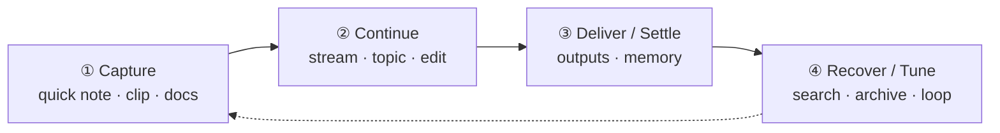
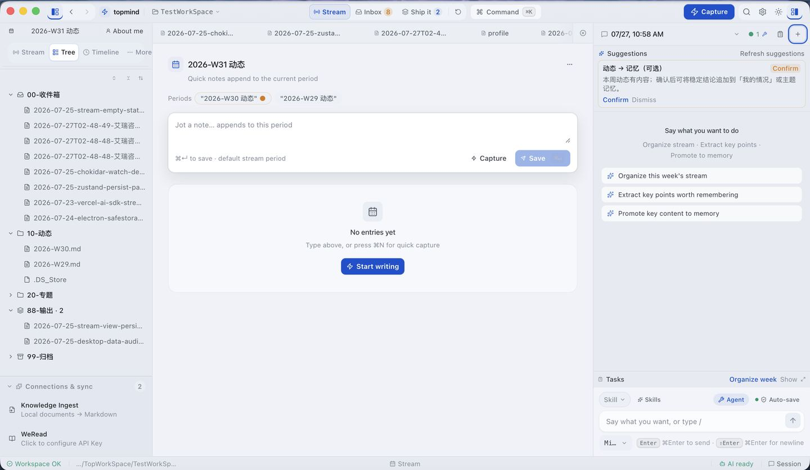
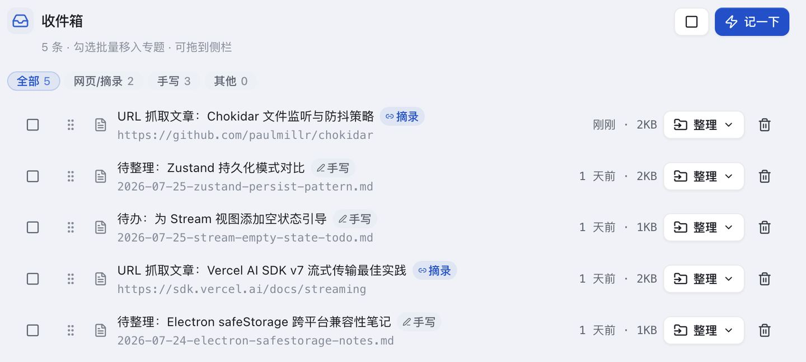
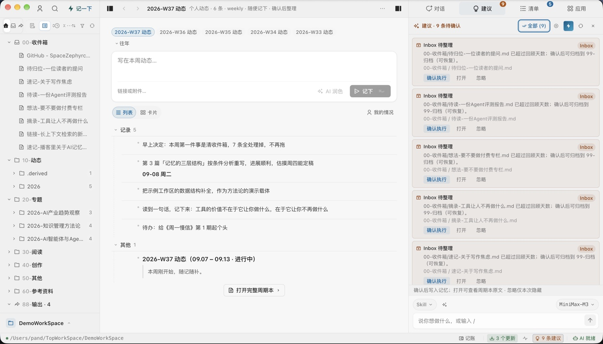
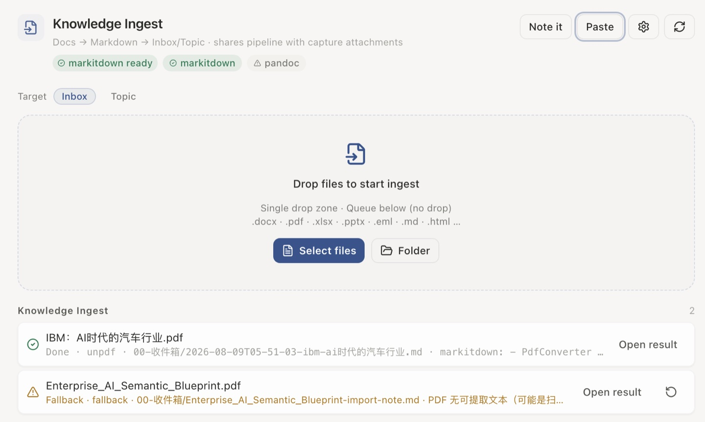
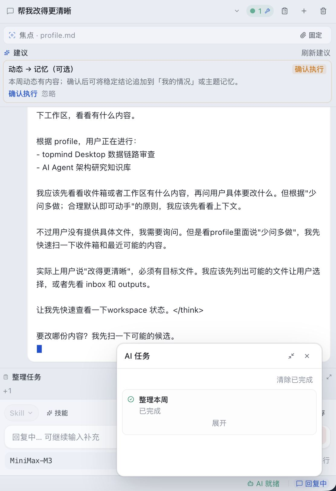
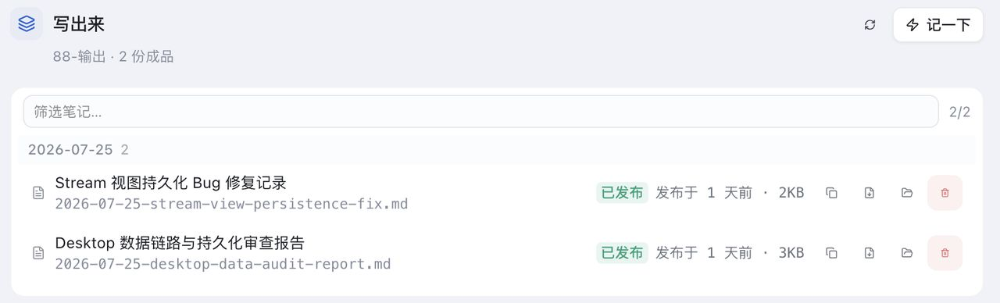

# topmind

[中文](README.md) · [English](README.en.md)

[](https://github.com/topmindspace/topmind/releases)
[](LICENSE)
[](https://nodejs.org)
[](#-product-entry-matrix-four-cores--clip-distribution)
[](https://github.com/topmindspace/topmind/actions)

> **Local-first Personal Knowledge Workbench in the AI Agent Era · Personal Stream**  
> **Jot freely** -> **AI suggests / organizes / extracts todos & memory** -> **You review & confirm** -> **Files stay yours forever**

---

## 💡 Why topmind?

Whether using traditional note-taking tools (such as Obsidian, Logseq) or recent AI knowledge bases, LLM Wikis, and Knowledge Graphs, something always feels missing. The fundamental pain point: **knowledge maintenance is overly complex and counterproductive** — too much time and energy are spent on manual folder organization, tagging, formatting, and bi-directional linking instead of fluid thinking and creation.

Topmind was created with a clear philosophy — a **low-friction, flexible, and all-in-one** personal knowledge and task workspace:

- ⚡ **Jot freely, zero cognitive burden**: Whether it's sudden thoughts, web clips, document parsing, or drafting, capture happens naturally in one place without hesitation about "where to put it".
- 🌊 **Capture first, classify later**: Default surface is a fluid timeline stream. Write down thoughts instantly without forced filing decisions.
- 🤖 **AI as an intelligent engine, proactive yet unobtrusive**: When AI is enabled, it automatically senses your workspace context to offer timely suggestions for knowledge organizing and todo tasks — **AI proposes and executes, you retain full control**.
- 🛡️ **Local-first, transparent & secure**: Stored in plain Markdown files and standard folder structures. No proprietary vault locks, databases, or cloud dependencies.

---

## 🚀 30-Second Quick Start

Choose the entrance that fits your daily workflow:

```text
topmind  =  Portable Skills  ⊕  Optional Desktop  ⊕  Optional UTR  ⊕  Optional Obsidian
            Agent skill pack     Rich workbench app    CLI / MCP tools        Vault-embedded plugin
          + Optional Clip distribution (Desktop capture companion; not a separate Kernel host)
```

### 📱 Scenario 1: Standalone Desktop App (Topmind Desktop)
1. Go to [Releases](https://github.com/topmindspace/topmind/releases) and download the installer for your OS (`.dmg` / `.exe` / `.AppImage` / `.deb`).
2. Launch the app, press `⌘N` (Mac) / `Ctrl+N` (Win) to capture a note anytime.
3. Detailed guide: [`topmind-desktop/README.md`](./topmind-desktop/README.md)

### 🔮 Scenario 2: Embedded in Obsidian (Topmind Stream Plugin)
1. Extract `topmind-obsidian-<ver>.zip` from Releases into `<Vault>/.obsidian/plugins/topmind-stream/` (or install via BRAT plugin).
2. Enable the plugin in Obsidian settings, press `⌘P` to open Command Palette and run **Topmind: Open Stream Workbench**.
3. Detailed guide: [`obsidian-plugin/README.md`](./obsidian-plugin/README.md) · [中文文档](./obsidian-plugin/README.zh-CN.md)

### 🤖 Scenario 3: Skills for AI Agents (Claude Code / OpenCode / Codex / Hermes…)
Two equivalent paths:

**A. Via Desktop (recommended — detect + install / upgrade / uninstall)**  
Open Desktop → **Settings → Companions**: auto-detects Claude Code / Codex / Hermes / OpenCode / CodeBuddy / WorkBuddy (best-effort), Chrome-family browsers, and Obsidian. Install / upgrade / uninstall Skills into host global skills roots; prepare Clip extension folder with guided Load-unpacked; install Obsidian plugin into the current workspace vault.

**B. Standalone CLI / pack (no Desktop)**
```bash
npm run skills:install          # or: node scripts/install-skills.mjs add topmindspace/topmind -g
```
Guide: [`skills/INSTALL.md`](./skills/INSTALL.md) · [`SKILL-ARCHITECTURE.md`](./SKILL-ARCHITECTURE.md)

### ✂️ Scenario 4: Browser Clip Extension
1. **In Desktop**: Settings → Companions → Prepare Clip extension (extracts to a managed folder), then follow Load-unpacked instructions (browsers block silent sideload).  
2. **Standalone**: download `topmind-clip-extension-<ver>.zip` from [Releases](https://github.com/topmindspace/topmind/releases) and load unpacked the same way.  
3. Configure Desktop Clip Bridge (recommended) or a local workspace folder. Guide: [`browser-extension/README.md`](./browser-extension/README.md)

### 🌐 Language / locale

- UI and workspace contract support **zh-CN / en-US** (Settings → General → UI language; workspace `topmind.yaml` `locale` / `workspace.locale`).
- **AI follows locale**: agent system prompts, inline polish/continue, todo extract/maintain, suggestion copy, and durable headings such as `memory/todo.md` are generated in the resolved language.
- Extension and Obsidian plugin locales keep key parity with Desktop.

### 🔄 How to upgrade

| Surface | Upgrade path |
|---------|--------------|
| **Desktop** | Newer package from Releases, or in-app **About → Check for updates**; workspace files stay |
| **Skills** | Desktop **Settings → Companions** → Upgrade on a detected host; or `npm run skills:update` / CLI ([`skills/INSTALL.md`](./skills/INSTALL.md)) |
| **Obsidian** | Companions install into current vault, or replace `plugins/topmind-stream/` / BRAT; vault content stays |
| **Clip** | Companions Prepare overwrites managed dir, then reload in `chrome://extensions`; or standalone new zip |
| **UTR** | Ships inside Desktop; source uses repo `utr/` |

Full product tag **`v*`** packs Skills + Extension + **Obsidian** + Desktop; surface tags `skills-v*` / `extension-v*` / `obsidian-v*` / `desktop-v*` build only that surface. See [`docs/PACKAGING.md`](./docs/PACKAGING.md).

---

## 🧩 Product entry matrix (four cores + Clip distribution)

**Four product cores** (`PRODUCT-BOUNDARIES.md`): Skills · Desktop · UTR · Obsidian — they share content conventions and behavior contracts only (no hard runtime binding).  
**Clip** is a companion distribution surface for Desktop capture (not a separate Kernel host). Version numbers are managed independently (major aligned, minor independent): run `npm run versions` to inspect current versions.

| Entry / Surface | Target Audience / Use Case | Truth Source (Version Truth) | Dedicated Docs | Version Policy |
|-----------------|----------------------------|------------------------------|----------------|----------------|
| 🖥️ **Desktop** (core) | Users needing a rich text workbench with visual AI review UI | [`topmind-desktop/package.json`](./topmind-desktop/package.json) | [`topmind-desktop/README.md`](./topmind-desktop/README.md) | Independent |
| 🔮 **Obsidian Plugin** (core) | Users who want to embed the personal stream directly inside Obsidian Vaults | [`obsidian-plugin/manifest.json`](./obsidian-plugin/manifest.json) | [`obsidian-plugin/README.md`](./obsidian-plugin/README.md) | Independent |
| 🤖 **Skills** (core) | Users driving workflows via Claude Code, OpenCode, or other AI agents | [`skills/topmind-pack.json`](./skills/topmind-pack.json) | [`skills/INSTALL.md`](./skills/INSTALL.md) | Independent |
| 🛠️ **UTR CLI/MCP** (core) | Users requiring deterministic CLI tools or MCP servers in Terminal | [`utr/VERSION`](./utr/VERSION) | [`TOOLS.md`](./TOOLS.md) · [`utr/README.md`](./utr/README.md) | Follows Desktop |
| ✂️ **Clip Extension** (distribution) | Browser one-click capture; lands in Desktop workspace via Bridge | [`browser-extension/manifest.json`](./browser-extension/manifest.json) | [`browser-extension/README.md`](./browser-extension/README.md) | Independent |

---

## ⚡ Core Workflow

```text
Capture -> Continue -> Deliver / Settle -> Recover / Tune
```



| Stage | Action | Default Landing | Description |
|-------|--------|-----------------|-------------|
| **① Capture** | Quick note · web clip · doc ingest queue | Weekly **stream** period note (`10-动态/`); unclear ➔ `00-收件箱/` | Zero-friction rapid capture |
| **② Continue** | Edit · inline AI · side agent · topic organize | `{Category}/{YYYY-Topic}/` | Stream cards timeline & topic emergence |
| **③ Deliver / Settle** | Ship deliverables · confirm profile / topic memory | `88-输出/` · `memory/profile.md` | Produce final outputs, update memory profile |
| **④ Recover / Tune** | Search · restore · periodic maintenance | `99-归档/` · Loop inspect | Safety archive & fast retrieval |

**Save Settings**:
- **Ask Before Save** (`writeback_mode: confirm`): AI proposes modifications to the Suggestion Popover, written to disk only after your review & approval.
- **Auto Save** (`writeback_mode: auto`): AI updates files directly; **high-impact only** (locked overwrite, delete/archive) keeps recoverable copies + receipts under `99-归档/`. Routine open-file updates stay light.

---

## 🗂️ Three-Plane Workspace Model

Topmind structures your workspace into three logical, deterministic planes:

```text
{workspace}/
├── topmind.yaml              # ⚙️ System Plane: Contract facade & behavior settings
├── 00-收件箱/                # 📥 Content Plane: Buffer inbox
├── 10-动态/                  # 🌊 Content Plane: Period notes (timeline stream)
├── 20-专题/2026-Topic/        # 📂 Content Plane: Emergent topic folders
│   └── topic.md              # 📄 Topic homepage
├── 88-输出/                  # 📤 Content Plane: Flat deliverables
├── 99-归档/                  # 🛡️ Content Plane Safety Layer: backups · backups/trash · receipts
├── memory/                   # 🧠 Semantic Plane: profile (facts) · periodic (digests)
└── .topmind/                 # ⚙️ System Plane: Index & logs (can be deleted/rebuilt anytime)
```

| Plane | Typical Path | Stored Content |
|-------|--------------|----------------|
| **Content** | `{NN-Category}/` | Notes, weekly stream logs, topics, deliverables, and safety backups |
| **Semantic** | `memory/` | Stable personal facts profile (`profile.md`) and periodic summaries |
| **System** | `topmind.yaml` + `.topmind/` | Workspace behavior contract, index, and runtime logs |

**Six core rules:** non-overlapping categories · topics emerge · stream is special · catch-all cleanup · clear reference role · stable names — [`PROJECT-MODEL.md`](./PROJECT-MODEL.md).

---

## 🎨 Desktop Gallery

The three-rail layout: **Navigation ➔ Content ➔ AI Rail**. Primary narrative is **Stream**.

<p align="center">
  
</p>

<p align="center">
  
</p>

### Additional Views

<table>
  <tr>
    <td align="center" width="33%">
      <br/>
      <sub>Inbox organize</sub>
    </td>
    <td align="center" width="33%">
      <br/>
      <sub>Smart capture / clip</sub>
    </td>
    <td align="center" width="33%">
      <br/>
      <sub>Document ingest queue</sub>
    </td>
  </tr>
  <tr>
    <td align="center" width="33%">
      <br/>
      <sub>Inline AI (sanitized results)</sub>
    </td>
    <td align="center" width="33%">
      <br/>
      <sub>Side agent · todos & confirm</sub>
    </td>
    <td align="center" width="33%">
      <br/>
      <sub>Ship it / outputs</sub>
    </td>
  </tr>
</table>

---

## ✅ Core Capability Honesty Table

| Capability | Status |
|------|------|
| Capture / Period note / Editing / Web clip / Knowledge ingest | **Done** |
| Kernel write gate · Memory loop · Stream main surface | **Done** |
| Inline AI result sanitization (no thinking tags) | **Done** |
| Keyword search honest truncation · **No** embedding full-library semantic search | **Done** (intentional) |
| AI operations: todo maintain · **memory organize** (profile+periodic) · **topic classify** (content category `create_topic`) | **Done** (confirm; activity window; not in `memory/topics`) |
| Stream append · activity window · feed quiet suggestion chip | **Done** (Wave S\* · see [`docs/stream-first-optimization-scheme.md`](./docs/stream-first-optimization-scheme.md)) |

Decision lock & phases: [`docs/ARCHITECTURE-RESET.md`](./docs/ARCHITECTURE-RESET.md)

---

## 🛠️ Local Build & Quality Gate

```bash
# Clone repository
git clone https://github.com/topmindspace/topmind.git
cd topmind

# Start Desktop dev server
npm run desktop:dev

# Agent Skills test
npm run skills:test

# UTR CLI/MCP doctor & tool list
npm run utr:doctor
npm run utr:list            # list UTR domains and commands (8 domains / 27 commands)

# Start Obsidian Plugin dev server
npm run obsidian:dev
npm run obsidian:pack       # outputs dist/topmind-obsidian-<ver>.zip

# Run full quality gate validation
npm run validate
npm run versions            # print surface version numbers
```

---

## 🗺️ Global Documentation Sitemap

| I want to learn about… | Document Link |
|------------------------|---------------|
| Architecture lock & honesty status | [`docs/ARCHITECTURE-RESET.md`](./docs/ARCHITECTURE-RESET.md) |
| Surface boundaries & capabilities | [`PRODUCT-BOUNDARIES.md`](./PRODUCT-BOUNDARIES.md) |
| Data model & 6 core rules | [`PROJECT-MODEL.md`](./PROJECT-MODEL.md) |
| UI/UX product design & interaction | [`DESIGN.md`](./DESIGN.md) |
| Desktop Workbench guide | [`topmind-desktop/README.md`](./topmind-desktop/README.md) |
| Obsidian Plugin guide | [`obsidian-plugin/README.md`](./obsidian-plugin/README.md) · [中文](./obsidian-plugin/README.zh-CN.md) |
| Agent Skills architecture & install | [`SKILL-ARCHITECTURE.md`](./SKILL-ARCHITECTURE.md) · [`skills/INSTALL.md`](./skills/INSTALL.md) |
| UTR CLI/MCP commands reference | [`TOOLS.md`](./TOOLS.md) · [`utr/README.md`](./utr/README.md) |
| Browser clip extension guide | [`browser-extension/README.md`](./browser-extension/README.md) |
| Packaging, CI/CD & release guide | [`docs/PACKAGING.md`](./docs/PACKAGING.md) |
| Full documentation index | [`docs/README.md`](./docs/README.md) |

---

## 📄 License

[MIT License](LICENSE) © [TopMindSpace](https://github.com/topmindspace)
