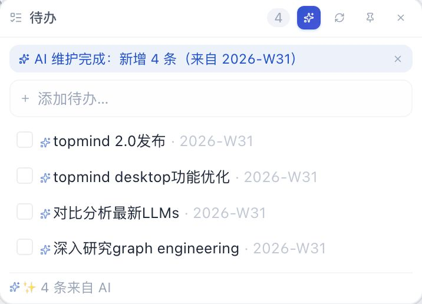
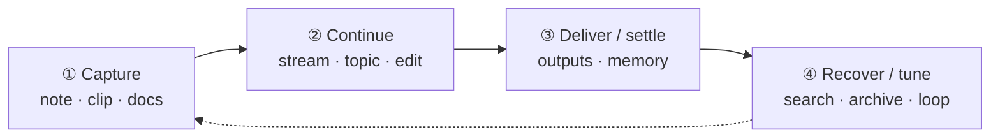
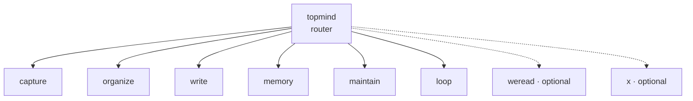

# topmind

[中文](README.md) · [English](README.en.md)

> **Local-first personal knowledge workbench · personal Stream.**  
> **Jot freely** · AI can **suggest / organize / todos / memory** · you **confirm** before durable writes · **files stay yours**.

---

### 💡 Why topmind?

Whether using traditional note-taking tools (like Obsidian) or recent AI knowledge bases, LLM Wikis, and Knowledge Graphs, something always feels missing. The root friction: **knowledge maintenance is overly complex and counterproductive** — too much time and energy are spent on manual filing, tagging, formatting, and linking instead of thinking and creating.

Topmind was created with a clear philosophy — a **low-friction, flexible, and all-in-one** personal knowledge and task workspace:

- **Jot freely, zero cognitive burden**: Whether it's sudden thoughts, web clips, document parsing, or drafting, capture happens naturally in one place without hesitation about "where to put it".
- **Simple & flexible all-in-one experience**: Balances lightweight personal knowledge management with daily task workflow.
- **AI as an intelligent engine, proactive yet unobtrusive**: When AI is enabled, it automatically senses your workspace context to offer timely suggestions for knowledge organizing and todo tasks — **AI proposes and executes, you retain full control**.
- **Open and extensible**: Connects seamlessly to external knowledge sources. For example, using WeRead open Skills to sync book highlights and reviews, or archiving X (Twitter) bookmarks and timelines.

**Let tools remain helpful assistants, let thinking stay fluid, and keep files forever yours.**

```text
topmind  =  Portable Skills  ⊕  Optional Desktop  ⊕  Optional UTR
            agent skill pack     rich workbench        CLI / MCP
```

The three surfaces share **content conventions and behavior contracts only** — no hard runtime binding. Version numbers live only in truth sources: `npm run versions`.

| Surface | Truth source | Role |
|---------|--------------|------|
| **Skills** | [`skills/topmind-pack.json`](./skills/topmind-pack.json) | Agent skill semantics & routing |
| **Desktop** | [`topmind-desktop/package.json`](./topmind-desktop/package.json) | Local rich workbench / installers |
| **Clip** | [`browser-extension/manifest.json`](./browser-extension/manifest.json) | One-click browser clipper |
| **UTR** | [`utr/VERSION`](./utr/VERSION) | Optional CLI / MCP (deterministic tools) |

[Releases](https://github.com/topmindspace/topmind/releases) · [Repo](https://github.com/topmindspace/topmind)

---

## Why topmind

| You want… | How topmind helps |
|-----------|-------------------|
| **Personal Stream** | Default surface is your time-ordered stream — **jot freely**, no forced filing first |
| **Capture first** | ⌘N / stream **Save** lands in this week’s period note; unclear items go to inbox |
| **Files as truth** | Plain Markdown + folders — open anywhere, no proprietary vault lock-in |
| **Reversible AI** | Suggestions can generate freely · **confirm** before durable write · danger goes to archive |
| **One suggest entry** | Title-bar bulb + strip when items exist → **SuggestPopover** (auto-hide when empty) |
| **AI todos / Memory / topics** | Activity-window organize · personal list · profile/periodic · content-category topics |
| **One workflow** | Capture → continue → deliver/settle → recover/tune |
| **Composable** | Skills only / Desktop only / + optional UTR — no forced stack |

**Five user concepts (hard cap):** **note it · stream · topic · about me · ship it**.

The UI never teaches: protection levels, engine names, or UTR command IDs. Settings stay plain language (“ask before save”, “don’t let AI edit locked notes”).

### Highlights: AI todos · Memory · AI suggestions

<p align="center">
  
</p>

| Capability | How you use it | What it does |
|------------|----------------|--------------|
| **Note it** | Title-bar primary · ⌘N | **Only** full capture (notes / links / files) |
| **Save** | Stream composer primary | Append box to this week’s period (⌘↵) |
| **AI Polish** | Next to stream composer | Rewrites box only · does not save · not Note it |
| **AI todos** | Stream header / sidebar ✨ · ⌘⇧T | Extract / detect done / force retry (`memory/todo.md`) |
| **Memory** | Sidebar About me | `memory/profile.md`; apply after confirm |
| **AI suggestions** | Title-bar bulb / strip when count>0 → SuggestPopover | **Global confirm surface**; session-stable soft refresh; **confirm** before apply |

**Token control**: Settings → General — toggle **Auto-prepare AI suggestions** (default on) and **Auto AI maintain todos** (default **off**). Off means manual only. Status bar uses **one busy signal per path**: todo-maintain alone shows only “AI maintaining todos” (not also “AI working”); chat streaming / background tasks use “AI working”; suggest prepare shows its own chip.

---

## Core workflow

```text
收进来 -> 继续做 -> 交付/沉淀 -> 找回/调整
```



| Stage | What you do | Default landing |
|-------|-------------|-----------------|
| **Capture** | Quick note · web clip · Office/PDF queue | Current **stream** period; unclear → inbox |
| **Continue** | Edit · inline AI · side agent · grow topics | `{category}/{YYYY-topic}/` |
| **Deliver / settle** | Ship outputs · confirm profile / topic memory | delivery folder · `memory/` |
| **Recover / tune** | Search · restore · periodic maintain | archive · Loop |

Writeback: `auto` (save + receipt) or `confirm` (suggest freely · **apply after confirm**). Protection: `open` / `locked`.

---

## Skills: single daily entry `topmind`

Modules route by intent — **no** parallel front doors.



| Kind | Modules | Role |
|------|---------|------|
| **Entry** | `topmind` | Intent routing · multi-intent split |
| **Actions** | `capture` · `organize` · `write` · `memory` · `maintain` · `loop` | Daily loop |
| **Connectors** | `weread` · `x` | Optional external sources |
| **Shared** | `skills/shared/*` | Receipts · long-URL · ingest · degradation |

Install: [`skills/INSTALL.md`](./skills/INSTALL.md) · Architecture: [`SKILL-ARCHITECTURE.md`](./SKILL-ARCHITECTURE.md)

---

## Desktop workbench gallery

Default narrative is **stream** — **nav · content · AI rail**.

<p align="center">
  
</p>

<p align="center">
  
</p>

### Capture · continue · deliver

<table>
  <tr>
    <td align="center" width="33%">
      <br/>
      <sub>Inbox</sub>
    </td>
    <td align="center" width="33%">
      <br/>
      <sub>Smart capture</sub>
    </td>
    <td align="center" width="33%">
      <br/>
      <sub>Ingest queue</sub>
    </td>
  </tr>
  <tr>
    <td align="center" width="33%">
      <br/>
      <sub>Inline AI (result-only)</sub>
    </td>
    <td align="center" width="33%">
      <br/>
      <sub>Side agent · confirm queue</sub>
    </td>
    <td align="center" width="33%">
      <br/>
      <sub>Ship it / outputs</sub>
    </td>
  </tr>
</table>

Full tour → [`topmind-desktop/README.md`](./topmind-desktop/README.md) · Images → [`docs/images/README.md`](./docs/images/README.md)

---

## Three planes & workspace

```text
{workspace}/
├── topmind.yaml              # system: behavior contract
├── 00-inbox/                 # content: buffer
├── 10-stream/                # content: period notes (flat by default)
├── 20-topics/2026-…/
│   └── topic.md
├── 88-outputs/               # content: flat deliverables
├── 99-archive/               # safety: backups · backups/trash · receipts
├── memory/                   # semantic: profile · periodic · topics
└── .topmind/                 # system: rebuildable machine state
```

| Plane | Path | What people remember |
|-------|------|----------------------|
| **Content** | `{NN-Name}/` | Notes · topics · outputs |
| **Semantic** | `memory/` | Stable profile & periodic digests |
| **System** | `topmind.yaml` + `.topmind/` | Contract · index · logs |

**Six core rules:** non-overlapping categories · topics emerge · stream is special · catch-all cleanup · clear reference role · stable names — [`PROJECT-MODEL.md`](./PROJECT-MODEL.md).

Profiles: `stream` (default) · `balanced` · `research` · `periodic`.

---

## Honesty table

| Capability | Status |
|------------|--------|
| Capture · edit · clip · document ingest | **Done** |
| skill-first AI · suggestions · pending writes | **Done** |
| Kernel write-gate · Memory loop · stream-first nav | **Done** |
| Inline AI result sanitize (no thinking tags in notes) | **Done** |
| Keyword search honesty · **no** full-library embedding search | **Done** (by design) |
| AI ops: todo maintain · **memory organize** (profile+periodic) · **topic classify** (content-category `create_topic`) | **Done** (confirm; activity window; not `memory/topics`) |
| Stream append · activity window · canvas-top SuggestEntryStrip → ActionBar | **Done** (Wave S\* · see `docs/stream-first-optimization-scheme.md`) |

Architecture lock: [`docs/ARCHITECTURE-RESET.md`](./docs/ARCHITECTURE-RESET.md)

---

## Comparison

| | Notion | Obsidian | Notes | **topmind** |
|--|--------|----------|-------|-------------|
| Data | Cloud | Local MD | iCloud | **Local MD** |
| Org | DB / pages | Links + folders | Folders | **Capture first** |
| Ingest | Extension | Plugins | Share | **Built-in queue** |
| AI | Built-in | Plugins | System | **Co-pilot + reversible** |

Full guide: [`docs/topmind-vs-others.md`](./docs/topmind-vs-others.md)

---

## Install & develop

```bash
npm run desktop:dev
npm run desktop:pack:mac    # or :linux / :win
npm run skills:install      # see skills/INSTALL.md
npm run skills:test         # skills contract tests
npm run utr:doctor
npm run utr:list            # list UTR domains and commands (8 domains / 25 commands)
npm run validate
npm run versions
```

| I want… | Go to |
|---------|--------|
| Desktop workbench | [`topmind-desktop/README.md`](./topmind-desktop/README.md) |
| Agent Skills | [`skills/INSTALL.md`](./skills/INSTALL.md) · [`skills/README.md`](./skills/README.md) |
| CLI / MCP | [`TOOLS.md`](./TOOLS.md) · [`utr/README.md`](./utr/README.md) |
| Clip extension | [`browser-extension/README.md`](./browser-extension/README.md) |
| Boundaries | [`PRODUCT-BOUNDARIES.md`](./PRODUCT-BOUNDARIES.md) |
| Content model | [`PROJECT-MODEL.md`](./PROJECT-MODEL.md) |
| Product UX | [`DESIGN.md`](./DESIGN.md) |
| Packaging / CI | [`docs/PACKAGING.md`](./docs/PACKAGING.md) |
| Doc index | [`docs/README.md`](./docs/README.md) |

---

## Doc map

| Doc | Role |
|-----|------|
| [ARCHITECTURE-RESET](./docs/ARCHITECTURE-RESET.md) | Decisions · phases · honesty |
| [PRODUCT-BOUNDARIES](./PRODUCT-BOUNDARIES.md) | Skills / Desktop / UTR |
| [PROJECT-MODEL](./PROJECT-MODEL.md) | Model · 6 rules |
| [DESIGN](./DESIGN.md) | Product UX · ≤5 concepts |
| [SKILL-ARCHITECTURE](./SKILL-ARCHITECTURE.md) | Skills pack shape |
| [TOOLS](./TOOLS.md) | UTR · writeback |
| [AGENTS](./AGENTS.md) | Agent discipline |
| [SECURITY](./SECURITY.md) | Security boundaries |

---

Repo: [github.com/topmindspace/topmind](https://github.com/topmindspace/topmind) · License: MIT
