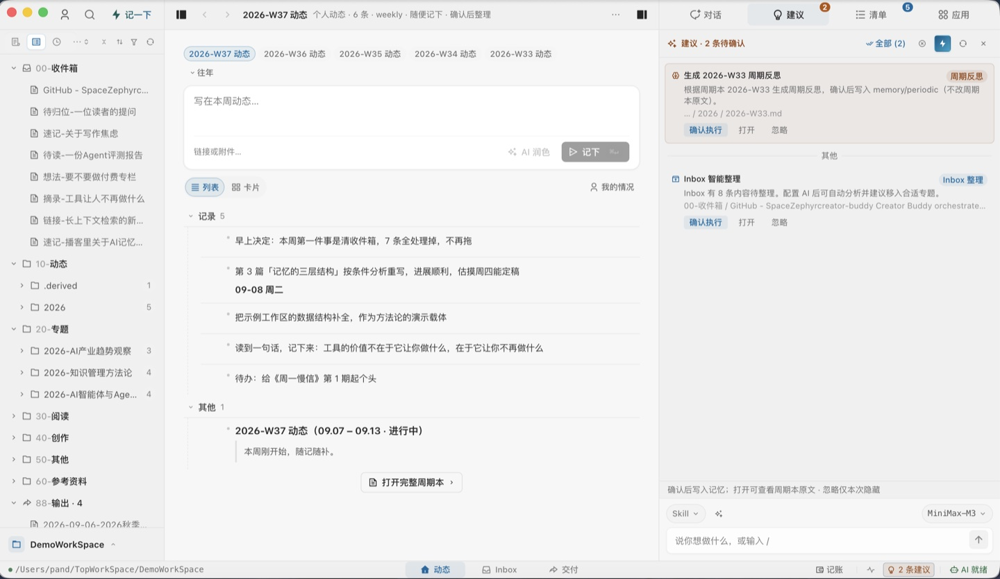
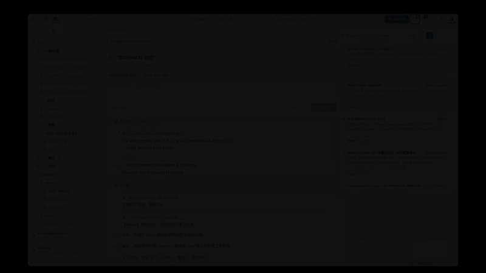
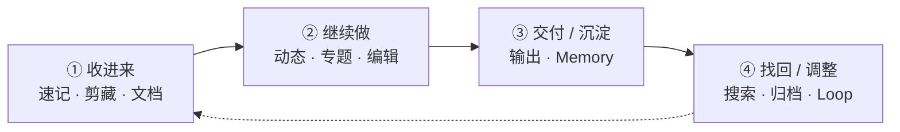

# topmind

[中文](README.md) · [English](README.en.md)

[](https://github.com/topmindspace/topmind/releases)
[](LICENSE)
[](https://nodejs.org)
[](#快速上手与安装入口)
[](https://github.com/topmindspace/topmind/actions)

> **Agent 时代的本地优先个人动态流与知识工作台 · Personal Stream**  
> **随便记下** → **AI 自动建议 / 整理 / 待办 / 记忆** → **用户确认后再沉淀** → **文件永远属于本地**

---

## 界面与全流程演示 (Showcase)

### 动态主表面 (Stream & AI Suggestions)

<p align="center">
  
</p>

### 全流程动态演示 (Product Demo)

<p align="center">
  
</p>

<p align="center">
  <sub>如果您的环境无法自动播放，可直接下载或用本地播放器打开 <a href="./docs/images/topmind-demo.mp4">HD MP4 高清演示视频</a></sub>
</p>

---

## 为什么选择 topmind？

使用传统笔记软件（如 Obsidian、Logseq）或现代 AI 知识库时，常会产生一个痛点：**知识维护过于繁琐**——大量精力被消耗在手动分类、打标签、调整格式与建构双链上，消耗了创作与思考的热情。

Topmind 的初衷是打造一个**低摩擦、灵活且一站式**的个人知识与日常工作管理工具：

- **随时记录，零负担**：突发想法、网页剪藏、文档抓取与起草创作，一站式自然完成，不再为“放在哪里”而犹豫。
- **先记后分，流式体验**：默认呈现动态时间轴。随手记下，不需要在创作前做出复杂的目录与归档决策。
- **AI 智能底座，主动而不打扰**：开启 AI 时，系统感知工作区上下文，主动给出恰到好处的知识整理与待办建议——**AI 负责建议与搬砖，用户掌握最终裁决权**。
- **本地优先，透明安全**：纯标准 Markdown 文件夹存储。文件即真源，永远存放在本地磁盘，无专有数据库绑定。

---

## 快速上手与安装入口

Topmind 由四个核心表面与一个剪藏 companion 扩展组成。根据你的工作流习惯，选择最适合你的入口：

```text
topmind  =  Portable Skills  ⊕  Optional Desktop  ⊕  Optional UTR  ⊕  Optional Obsidian
            AI 技能包（Agent）    富工作台（独立应用）    CLI / MCP 工具         Vault 内嵌插件
          + Optional Clip 剪藏分发面（Desktop 捕获 companion，非独立 Kernel 宿主）
```

### 场景 1：使用独立桌面工作台 (Topmind Desktop)

> 适用场景：需要独立富文本应用与可视化 AI 确认界面的用户。

- **方式 A：Homebrew 快捷安装 (macOS 推荐 · 一键解隔离免报错)**：
  ```bash
  brew install topmindspace/tap/topmind
  ```
  *通过 Homebrew 安装会自动清理 macOS `quarantine` 属性，免去未签名应用的“已损坏无法打开”报错。*

- **方式 B：手动下载安装包**：
  1. 前往 [Releases](https://github.com/topmindspace/topmind/releases) 下载适用于你系统的安装包 (`.dmg` / `.exe` / `.AppImage` / `.deb`)。
  2. 安装并打开，快捷键 `⌘N` (Mac) / `Ctrl+N` (Win) 随时随地极速记一条。  
     *(macOS 若手动安装提示损坏打不开，可在终端运行：`sudo xattr -rd com.apple.quarantine /Applications/Topmind.app`)*
3. 详细指南：[`topmind-desktop/README.md`](./topmind-desktop/README.md)

### 场景 2：在 Obsidian 中使用 (Topmind Stream Plugin)

> 适用场景：希望在现有 Obsidian Vault 中直接使用动态流的用户。

- **方式 A：Obsidian 官方社区插件市场 (Community Plugin Store)**：
  *(官方社区插件审核发布中)* 上架后可在 Obsidian **设置 ➔ 社区插件 ➔ 浏览** 搜索 `topmind stream` 一键安装。
- **方式 B：BRAT 插件一键安装**：
  在 Obsidian BRAT 插件中添加 GitHub 仓库 `topmindspace/topmind` 快捷安装。
- **方式 C：手动解压安装**：
  从 [Releases](https://github.com/topmindspace/topmind/releases) 下载 `topmind-obsidian-<ver>.zip` 解压至 `<Vault>/.obsidian/plugins/topmind-stream/`。
- 打开插件后，在 Obsidian 中按 `⌘P` 打开命令面板，运行 **Topmind: 打开动态**。
- 详细指南：[`obsidian-plugin/README.zh-CN.md`](./obsidian-plugin/README.zh-CN.md) · [English Doc](./obsidian-plugin/README.md)

### 场景 3：为 Agent (Claude Code / OpenCode / Codex) 导入 Skills

> 适用场景：使用 AI Agent 驱动本地工作流的用户。

- **路径 A（通过 npx 社区 CLI & skills.sh 直连安装）**：
  ```bash
  npx skills add topmindspace/topmind -g -y
  ```
- **路径 B（通过 Desktop 界面一键管理 · 推荐）**：  
  打开 Desktop ➔ **设置 ➔ 管理与更新**：系统自动探测本机 Claude Code / OpenCode / Codex 等宿主，点击一键安装 Skills 到宿主全局。
- **路径 C（通过源码 CLI 命令安装）**：  
  ```bash
  npm run skills:install        # 或 node scripts/install-skills.mjs add topmindspace/topmind -g
  ```
- 详细指南：[`skills/INSTALL.md`](./skills/INSTALL.md) · [`SKILL-ARCHITECTURE.md`](./SKILL-ARCHITECTURE.md)

### 场景 4：浏览器剪藏 (Clip Extension)

> 适用场景：网页一键抓取与正文加工。

1. 从 Desktop **设置 ➔ 管理与更新** 点击“准备剪藏扩展”解压托管目录，按引导在 Chrome/Edge 中以“加载已解压的扩展”安装。
2. 或直接从 [Releases](https://github.com/topmindspace/topmind/releases) 下载 `topmind-clip-extension-<ver>.zip` 手动加载。
3. 详细指南：[`browser-extension/README.md`](./browser-extension/README.md)

### 场景 5：Terminal 命令行与 MCP 服务器 (UTR CLI / MCP)

> 适用场景：需要在 Terminal 或 MCP Server 环境中运行确定性工具的用户。

- 随 Desktop 安装包一并打包分发，或在本地仓库直接使用源码 `utr/` 目录。
- 查看当前 UTR 动作域和命令：
  ```bash
  npm run utr:doctor            # UTR 工具链诊断
  npm run utr:list              # 查看当前 8 域 / 28 命令
  ```
- 详细指南：[`TOOLS.md`](./TOOLS.md) · [`utr/README.md`](./utr/README.md)

---

## 核心工作流

```text
收进来 -> 继续做 -> 交付/沉淀 -> 找回/调整
```



| 阶段 | 用户动作 | 默认落点 | 说明 |
|------|----------|----------|------|
| **① 收进来** | 快捷键速记 · 网页剪藏 · Office/PDF 入队 | 本周**动态**周期本 (`10-动态/`)；不确定 ➔ `00-收件箱/` | 零摩擦极速捕捉 |
| **② 继续做** | 编辑 · 行内 AI · 侧栏 Agent · 整理专题 | `{大类}/{YYYY-主题}/` | 动态卡片流与专题沉淀 |
| **③ 交付 / 沉淀** | 写出成品 · 确认后写入 profile / topics | `88-输出/` · `memory/profile.md` | 产出成品文件，更新个人画像 |
| **④ 找回 / 调整** | 搜索 · 恢复 · 周期维护 | `99-归档/` · Loop 巡检 | 安全归档与快速检索 |

---

## 三平面目录模型

Topmind 将工作区组织为清晰的三个平面，逻辑自洽且可预测：

```text
{工作区}/
├── topmind.yaml              # 系统平面：行为契约与门面配置
├── 00-收件箱/                # 内容平面：临时缓冲
├── 10-动态/                  # 内容平面：周期本（按年分组 {YYYY}/周期本.md）
├── 20-专题/2026-某主题/       # 内容平面：涌现专题目录
│   └── topic.md              # 专题首页
├── 88-输出/                  # 内容平面：扁平交付文件
├── 99-归档/                  # 内容平面安全层：backups · backups/trash · receipts
├── memory/                   # 语义平面：profile (画像) · periodic (反思)
└── .topmind/                 # 系统平面：索引与日志 (可随时删除与重建)
```

---

## 核心能力诚实表

| 能力 | 状态 | 说明 |
|------|------|------|
| 捕获 / 周期本 / 编辑 / 剪藏 / 知识加工 | **Done** | 零摩擦流式记录与多源文件解析 |
| Kernel 写闸 · Memory 闭环 · 动态主表面 | **Done** | 确认后再落盘，改动可撤销与恢复 |
| 行内 AI 结果清洗 | **Done** | 自动过滤与清洗思考标签 (Thought Tags) |
| 关键词搜索诚实截断 · **无** embedding 全库语义检索 | **Done** | 保持轻量与透明，防全库泛滥 |
| AI 操作：todo 维护 · 记忆整理 · 专题建议 | **Done** | 活动窗口驱动，confirm 模式安全控制 |
| 多路 AI 串行与独立会话 | **Done** | 后台 Prep 串行，Agent streaming 时让路 |

---

## 四体核心 + Clip 分发面与版本真源

**四体核心**（[`PRODUCT-BOUNDARIES.md`](./PRODUCT-BOUNDARIES.md)）：Skills · Desktop · UTR · Obsidian — 共享内容约定与行为契约。**Clip Extension** 为 Desktop 捕获 companion 分发面（非独立 Kernel 宿主）。各表面独立版本管理（大版本对齐，小版本独立），运行 `npm run versions` 查看：
- **Skills**: [`skills/topmind-pack.json`](./skills/topmind-pack.json) (详情参阅 [`skills/INSTALL.md`](./skills/INSTALL.md))
- **Desktop**: [`topmind-desktop/package.json`](./topmind-desktop/package.json) (详情参阅 [`topmind-desktop/README.md`](./topmind-desktop/README.md))
- **UTR**: [`utr/VERSION`](./utr/VERSION) (详情参阅 [`TOOLS.md`](./TOOLS.md))
- **Obsidian**: [`obsidian-plugin/manifest.json`](./obsidian-plugin/manifest.json) (详情参阅 [`obsidian-plugin/README.zh-CN.md`](./obsidian-plugin/README.zh-CN.md))
- **Clip Extension**: [`browser-extension/manifest.json`](./browser-extension/manifest.json) (详情参阅 [`browser-extension/README.md`](./browser-extension/README.md))

---

## 本地构建与开发

```bash
# 克隆仓库
git clone https://github.com/topmindspace/topmind.git
cd topmind

# 启动 Desktop 开发环境
npm run desktop:dev

# 运行能力测试
npm run skills:test

# 运行全量质量门校验
npm run validate
npm run versions            # 打印各表面当前版本号
```

---

## 全局文档地图

| 想要了解… | 对应文档 |
|-----------|----------|
| 架构决策锁与诚实状态 | [`docs/ARCHITECTURE-RESET.md`](./docs/ARCHITECTURE-RESET.md) |
| 表面能力与硬边界 | [`PRODUCT-BOUNDARIES.md`](./PRODUCT-BOUNDARIES.md) |
| 数据模型与 6 条核心规约 | [`PROJECT-MODEL.md`](./PROJECT-MODEL.md) |
| UI/UX 产品设计交互 | [`DESIGN.md`](./DESIGN.md) |
| Desktop 富工作台说明 | [`topmind-desktop/README.md`](./topmind-desktop/README.md) |
| Obsidian 插件说明 | [`obsidian-plugin/README.zh-CN.md`](./obsidian-plugin/README.zh-CN.md) · [English](./obsidian-plugin/README.md) |
| Agent Skills 架构与安装 | [`SKILL-ARCHITECTURE.md`](./SKILL-ARCHITECTURE.md) · [`skills/INSTALL.md`](./skills/INSTALL.md) |
| UTR CLI/MCP 命令字典 | [`TOOLS.md`](./TOOLS.md) · [`utr/README.md`](./utr/README.md) |
| 浏览器剪藏扩展说明 | [`browser-extension/README.md`](./browser-extension/README.md) |
| 打包发布与 CI/CD 说明 | [`docs/PACKAGING.md`](./docs/PACKAGING.md) |
| 全局文档索引中心 | [`docs/README.md`](./docs/README.md) |

---

## 开源协议

[MIT License](LICENSE) © [TopMindSpace](https://github.com/topmindspace)
