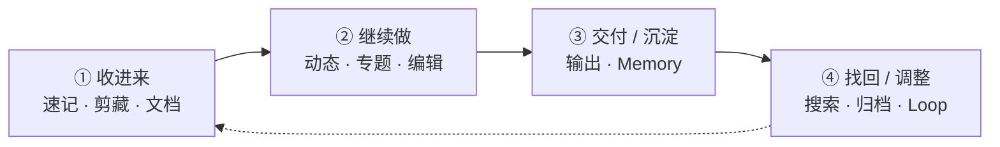

# topmind

[中文](README.md) · [English](README.en.md)

[](https://github.com/topmindspace/topmind/releases)
[](LICENSE)
[](https://nodejs.org)
[](#-产品入口矩阵四体核心--clip-分发)
[](https://github.com/topmindspace/topmind/actions)

> **Agent 时代的本地优先个人知识工作台 · 个人 Stream**  
> **随便记下** → **AI 自动建议 / 整理 / 待办 / 记忆** → **你确认后再沉淀** → **文件永远属于你**

---

## 💡 为什么选择 topmind？

使用传统笔记软件（如 Obsidian、Logseq）或现代 AI 知识库时，常会产生一个痛点：**知识维护过于繁琐**——大量精力被消耗在手动分类、打标签、调整格式与建构双链上，消耗了创作与思考的热情。

Topmind 的初衷是打造一个**低摩擦、灵活且一站式**的个人知识与日常工作管理工具：

- ⚡ **随时记录，零负担**：突发想法、网页剪藏、文档抓取与起草创作，一站式自然完成，不再为「放在哪里」而犹豫。
- 🌊 **先记后分，流式体验**：默认呈现动态时间轴。随手记下，不需要在创作前做出复杂的目录与归档决策。
- 🤖 **AI 智能底座，主动而不打扰**：开启 AI 时，系统感知工作区上下文，主动给出恰到好处的知识整理与待办建议——**AI 负责建议与搬砖，用户掌握最终裁决权**。
- 🛡️ **本地优先，透明安全**：纯标准 Markdown 文件夹存储。文件即真源，永远存放在你的本地磁盘，无专有数据库绑定。

---

## 🚀 30 秒快速上手

根据你的使用习惯，选择最适合你的入口：

```text
topmind  =  Portable Skills  ⊕  Optional Desktop  ⊕  Optional UTR  ⊕  Optional Obsidian
            AI 技能包（Agent）    富工作台（独立应用）    CLI / MCP 工具         Vault 内嵌插件
          + Optional Clip 剪藏分发面（Desktop 捕获 companion，非独立 Kernel 宿主）
```

### 📱 场景 1：使用独立桌面工作台 (Topmind Desktop)
1. 前往 [Releases](https://github.com/topmindspace/topmind/releases) 下载适用于你系统的安装包 (`.dmg` / `.exe` / `.AppImage` / `.deb`)。
2. 打开应用，快捷键 `⌘N` (Mac) / `Ctrl+N` (Win) 随时随地极速记一条。
3. 详细指南：[`topmind-desktop/README.md`](./topmind-desktop/README.md)

### 🔮 场景 2：在 Obsidian 中使用 (Topmind Stream Plugin)
1. 将 Release 中的 `topmind-obsidian-<ver>.zip` 解压至 `<Vault>/.obsidian/plugins/topmind-stream/` (或通过 BRAT 插件安装)。
2. 在 Obsidian 设置中启用插件，`⌘P` 打开命令面板运行 **Topmind: 打开动态工作台**。
3. 详细指南：[`obsidian-plugin/README.zh-CN.md`](./obsidian-plugin/README.zh-CN.md) · [English Doc](./obsidian-plugin/README.md)

### 🤖 场景 3：为 Agent (Claude Code / OpenCode / Codex / Hermes…) 导入 Skills
两条等价路径（二选一即可）：

**A. 通过 Desktop（推荐 · 环境探测 + 一键装/升/卸）**  
打开 Desktop → **设置 → 集成 (Companions)**：自动探测本机 Claude Code / Codex / Hermes / OpenCode / CodeBuddy / WorkBuddy 等宿主，以及 Chrome 族浏览器与 Obsidian；可对 Skills 执行安装 / 升级 / 卸载（优先装到宿主全局 skills 根），剪藏扩展「准备目录 + 引导加载」，Obsidian 插件装入当前工作区 vault。

**B. 独立 CLI / pack（无 Desktop 时）**
```bash
npm run skills:install          # 或 node scripts/install-skills.mjs add topmindspace/topmind -g
```
详细：[`skills/INSTALL.md`](./skills/INSTALL.md) · [`SKILL-ARCHITECTURE.md`](./SKILL-ARCHITECTURE.md)

### ✂️ 场景 4：浏览器剪藏 (Clip Extension)
1. **Desktop 内**：设置 → 集成 →「准备剪藏扩展」解压到本机托管目录，按引导在 Chrome/Edge 以「加载已解压的扩展」安装（浏览器安全模型禁止静默注入）。  
2. **独立安装**：从 [Releases](https://github.com/topmindspace/topmind/releases) 下载 `topmind-clip-extension-<ver>.zip`，同样手动加载。  
3. 配置 Desktop Clip Bridge（推荐）或本机工作区目录直写。指南：[`browser-extension/README.md`](./browser-extension/README.md)

### 🌐 语言 / 本地化

- UI 与工作区契约均支持 **zh-CN / en-US**（设置 → 通用 → 界面语言；工作区 `topmind.yaml` 的 `locale` / `workspace.locale`）。
- **AI 输出跟语言走**：Agent 系统提示、行内润色/续写、待办提取与维护、建议条等均按解析后的 locale 生成中文或英文提示与结果；`memory/todo.md` 标题等耐久文案也会按 locale 序列化。
- 扩展 / Obsidian 插件各自有 locale 文件，键与 Desktop 一样要求中英对齐。

### 🔄 升级怎么做

| 表面 | 升级路径 |
|------|----------|
| **Desktop** | Releases 新安装包覆盖安装，或应用内「关于 → 检查更新」；工作区文件保留 |
| **Skills** | Desktop **设置 → 集成** 对已探测宿主点「升级」；或 `npm run skills:update` / CLI（见 [`skills/INSTALL.md`](./skills/INSTALL.md)） |
| **Obsidian** | Desktop 集成页安装到当前 vault，或新 zip 覆盖 `plugins/topmind-stream/` / BRAT；Vault 内容保留 |
| **Clip** | 集成页「准备」覆盖托管目录后于 `chrome://extensions` 重新加载；或独立新 zip |
| **UTR** | 随 Desktop 安装包；源码用仓库 `utr/` |

完整产品标签 **`v*`** 会打包 Skills + Extension + **Obsidian** + Desktop；表面标签 `skills-v*` / `extension-v*` / `obsidian-v*` / `desktop-v*` 只构建对应表面。详见 [`docs/PACKAGING.md`](./docs/PACKAGING.md)。

---

## 🧩 产品入口矩阵（四体核心 + Clip 分发）

**四体核心**（`PRODUCT-BOUNDARIES.md`）：Skills · Desktop · UTR · Obsidian — 共享内容约定与行为契约，无强制运行时绑定。  
**Clip 剪藏扩展**是 Desktop 捕获链路的 companion 分发面（非独立 Kernel 宿主），与四体一并出现在版本矩阵中。各表面版本号独立管理（大版本对齐，小版本独立）：运行 `npm run versions` 查看当前版本。

| 入口 / 表面 | 适用人群 / 场景 | 真源文件 (Version Truth) | 专属文档 | 版本策略 |
|-------------|-----------------|--------------------------|----------|----------|
| 🖥️ **Desktop**（四体） | 需要独立富文本工作台与可视化 AI 确认界面的用户 | [`topmind-desktop/package.json`](./topmind-desktop/package.json) | [`topmind-desktop/README.md`](./topmind-desktop/README.md) | 独立 |
| 🔮 **Obsidian 插件**（四体） | 希望在现有 Obsidian Vault 中直接使用动态流的用户 | [`obsidian-plugin/manifest.json`](./obsidian-plugin/manifest.json) | [`obsidian-plugin/README.zh-CN.md`](./obsidian-plugin/README.zh-CN.md) | 独立 |
| 🤖 **Skills**（四体） | 使用 Claude Code / OpenCode 等 AI Agent 驱动工作流的用户 | [`skills/topmind-pack.json`](./skills/topmind-pack.json) | [`skills/INSTALL.md`](./skills/INSTALL.md) | 独立 |
| 🛠️ **UTR CLI/MCP**（四体） | 需要在 Terminal 或 MCP Server 中使用确定性命令的用户 | [`utr/VERSION`](./utr/VERSION) | [`TOOLS.md`](./TOOLS.md) · [`utr/README.md`](./utr/README.md) | 跟随 Desktop |
| ✂️ **剪藏扩展**（Clip 分发） | 浏览器一键抓取与正文加工；经 Bridge 落入 Desktop 工作区 | [`browser-extension/manifest.json`](./browser-extension/manifest.json) | [`browser-extension/README.md`](./browser-extension/README.md) | 独立 |

---

## ⚡ 核心工作流

```text
收进来 -> 继续做 -> 交付/沉淀 -> 找回/调整
```



| 阶段 | 用户动作 | 默认落点 | 说明 |
|------|----------|----------|------|
| **① 收进来** | 快捷键速记 · 网页剪藏 · Office/PDF 入队 | 本周**动态**周期本 (`10-动态/`)；不确定 ➔ `00-收件箱/` | 零摩擦极速捕捉 |
| **② 继续做** | 编辑 · 行内 AI · 侧栏 Agent · 整理专题 | `{大类}/{YYYY-主题}/` | 动态卡片流与专题沉淀 |
| **③ 交付 / 沉淀** | 写出成品 · 确认后写入 profile / topics | `88-输出/` · `memory/profile.md` | 产出成品文件，更新个人画像 |
| **④ 找回 / 调整** | 搜索 · 恢复 · 周期维护 | `99-归档/` · Loop 巡检 | 安全归档与快速检索 |

**保存设置**：
- **保存前问我**（`writeback_mode: confirm`）：AI 提出修改建议，显示在建议面板中，待你审阅确认后再落盘。
- **自动保存**（`writeback_mode: auto`）：AI 自动写入；**仅高影响**（locked 覆盖、删除/归档）在 `99-归档/` 保留可恢复副本与回执，日常 open 更新保持轻量。

---

## 🗂️ 三平面目录模型

Topmind 将工作区组织为清晰的三个平面，逻辑自洽且可预测：

```text
{工作区}/
├── topmind.yaml              # ⚙️ 系统平面：行为契约与门面配置
├── 00-收件箱/                # 📥 内容平面：临时缓冲
├── 10-动态/                  # 🌊 内容平面：周期本（按周时间轴平铺）
├── 20-专题/2026-某主题/       # 📂 内容平面：涌现专题目录
│   └── topic.md              # 📄 专题首页
├── 88-输出/                  # 📤 内容平面：扁平交付文件
├── 99-归档/                  # 🛡️ 内容平面安全层：backups · backups/trash · receipts
├── memory/                   # 🧠 语义平面：profile (画像) · periodic (摘要)
└── .topmind/                 # ⚙️ 系统平面：索引与日志 (可随时删除与重建)
```

| 平面 | 典型路径 | 存储内容 |
|------|----------|----------|
| **内容平面** | `{NN-名称}/` | 笔记、动态周期本、专题、交付文件与安全归档 |
| **语义平面** | `memory/` | 关于你的稳定个人画像 (`profile.md`) 与周期沉淀 |
| **系统平面** | `topmind.yaml` + `.topmind/` | 工作区行为契约、索引、运行日志 |

**6 条核心规约**：大类不重叠 · 专题自然涌现 · 动态类特殊 · 兜底清理 · 参考资料定位 · 类别命名稳定 — 详见 [`PROJECT-MODEL.md`](./PROJECT-MODEL.md)。

---

## 🎨 桌面工作台图览 (Desktop Gallery)

界面采用三栏式设计：**导航 ➔ 内容 ➔ AI 副驾**。主叙事为**动态时间轴**。

<p align="center">
  
</p>

<p align="center">
  
</p>

### 更多体验视图

<table>
  <tr>
    <td align="center" width="33%">
      <br/>
      <sub>收件箱整理</sub>
    </td>
    <td align="center" width="33%">
      <br/>
      <sub>智能捕获 / 抓取</sub>
    </td>
    <td align="center" width="33%">
      <br/>
      <sub>知识加工队列</sub>
    </td>
  </tr>
  <tr>
    <td align="center" width="33%">
      <br/>
      <sub>行内 AI（结果清洗）</sub>
    </td>
    <td align="center" width="33%">
      <br/>
      <sub>侧栏 Agent · 待办与确认</sub>
    </td>
    <td align="center" width="33%">
      <br/>
      <sub>写出来 / 交付</sub>
    </td>
  </tr>
</table>

---

## ✅ 核心能力诚实表

| 能力 | 状态 |
|------|------|
| 捕获 / 周期本 / 编辑 / 剪藏 / 知识加工 | **Done** |
| Kernel 写闸 · Memory 闭环 · 动态主表面 | **Done** |
| 行内 AI 结果清洗（不写思考标签） | **Done** |
| 关键词搜索诚实截断 · **无** embedding 全库语义检索 | **Done**（有意） |
| AI 操作：todo 维护 · **记忆整理**（profile+periodic）· **专题建议**（内容大类 `create_topic`） | **Done**（confirm；活动窗口；不进 `memory/topics`） |
| 动态增补 · 活动窗口 · feed 安静建议 chip | **Done**（Wave S\* · 见 [`docs/stream-first-optimization-scheme.md`](./docs/stream-first-optimization-scheme.md)） |

决策锁与阶段：[`docs/ARCHITECTURE-RESET.md`](./docs/ARCHITECTURE-RESET.md)

---

## 🛠️ 本地构建与质量门

```bash
# 克隆仓库
git clone https://github.com/topmindspace/topmind.git
cd topmind

# 启动 Desktop 开发环境与质量测试
npm run desktop:dev

# Agent Skills 测试
npm run skills:test

# UTR 工具链诊断（可选 CLI / MCP）
npm run utr:doctor
npm run utr:list            # 查看当前 UTR 动作域和命令（8 域 / 27 命令）

# 启动 Obsidian 插件开发环境
npm run obsidian:dev
npm run obsidian:pack       # 生成 dist/topmind-obsidian-<ver>.zip

# 运行全量质量门校验
npm run validate
npm run versions            # 打印各表面当前版本号
```

---

## 🗺️ 全局文档地图

| 想要了解… | 对应文档 |
|-----------|----------|
| 架构决策锁与诚实状态 | [`docs/ARCHITECTURE-RESET.md`](./docs/ARCHITECTURE-RESET.md) |
| 表面能力与硬边界 | [`PRODUCT-BOUNDARIES.md`](./PRODUCT-BOUNDARIES.md) |
| 数据模型与 6 条核心规约 | [`PROJECT-MODEL.md`](./PROJECT-MODEL.md) |
| UI/UX 产品设计交互 | [`DESIGN.md`](./DESIGN.md) |
| Desktop 富工作台说明 | [`topmind-desktop/README.md`](./topmind-desktop/README.md) |
| Obsidian 插件说明 | [`obsidian-plugin/README.zh-CN.md`](./obsidian-plugin/README.zh-CN.md) · [English](./obsidian-plugin/README.md) |
| Agent Skills 架构与安装 | [`SKILL-ARCHITECTURE.md`](./SKILL-ARCHITECTURE.md) · [`skills/INSTALL.md`](./skills/INSTALL.md) |
| UTR CLI/MCP 命令字典 | [`TOOLS.md`](./TOOLS.md) · [`utr/README.md`](./utr/README.md) |
| 浏览器剪藏扩展说明 | [`browser-extension/README.md`](./browser-extension/README.md) |
| 打包发布与 CI/CD 说明 | [`docs/PACKAGING.md`](./docs/PACKAGING.md) |
| 全局文档索引中心 | [`docs/README.md`](./docs/README.md) |

---

## 📄 开源协议

[MIT License](LICENSE) © [TopMindSpace](https://github.com/topmindspace)
