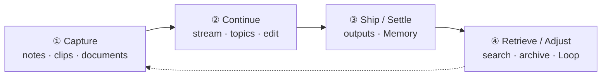

# topmind

[English](README.md) · [简体中文](README.zh-CN.md)

[](https://github.com/topmindspace/topmind/releases)
[](LICENSE)
[](https://nodejs.org)
[](#quick-start--installation)
[](https://github.com/topmindspace/topmind/actions)

> **Local-first personal stream and knowledge workbench for the agent era**  
> **Just log it** → **AI suggests, organizes, extracts todos, and maintains memory** → **You confirm before anything settles** → **Files stay yours**

---

## Interface and product demo

### Stream surface (timeline + AI suggestions)

<p align="center">
  
</p>

### Full product demo

<p align="center">
  
</p>

<p align="center">
  <sub>If the GIF does not play in your environment, download the <a href="./docs/images/topmind-demo.mp4">HD MP4 demo</a>.</sub>
</p>

---

## Why topmind?

Traditional note apps (Obsidian, Logseq) and modern AI knowledge bases often share one cost: **too much organization overhead**. Energy goes into folders, tags, formatting, and backlinks instead of thinking and writing.

topmind is a **low-friction, flexible, all-in-one** personal knowledge companion:

- **Instant capture, zero burden** — thoughts, web clips, document ingest, and drafting happen without deciding “where this belongs” first.
- **Log first, organize later** — the default surface is a stream timeline. Capture now; classify when ready.
- **Proactive, unobtrusive AI** — when AI is on, the system reads workspace context and offers just-enough organization and todo suggestions. **AI proposes and carries the work; you keep the final say.**
- **Local-first and transparent** — standard Markdown folders on disk. Files are the source of truth. No proprietary database lock-in.

---

## Quick start and installation

topmind is four core surfaces plus one clip companion. Pick the entry that matches how you work:

```text
topmind  =  Portable Skills  ⊕  Optional Desktop  ⊕  Optional UTR  ⊕  Optional Obsidian
            AI skills pack        Desktop app           CLI / MCP tools      Vault plugin
          + Optional Clip companion (Desktop capture distribution; not an independent Kernel host)
```

### Scenario 1: Standalone Desktop app

> Best when you want a dedicated rich-text workbench and a visual AI confirmation UI.

- **Option A — Homebrew (recommended on macOS)**:
  ```bash
  brew install topmindspace/tap/topmind
  ```
  Homebrew clears the macOS `quarantine` flag so unsigned builds do not show as “damaged”.

- **Option B — Manual installer**:
  1. Download `.dmg` / `.exe` / `.AppImage` / `.deb` from [Releases](https://github.com/topmindspace/topmind/releases).
  2. Launch the app and press `⌘N` (macOS) / `Ctrl+N` (Windows/Linux) to capture a note.  
     If macOS says the app is damaged after a manual install:  
     `sudo xattr -rd com.apple.quarantine /Applications/Topmind.app`
  3. Guide: [`topmind-desktop/README.md`](./topmind-desktop/README.md) · [简体中文](./topmind-desktop/README.zh-CN.md)

### Scenario 2: Inside Obsidian (topmind Stream plugin)

> Best when you want the personal stream inside an existing Obsidian vault.

- **Option A — Community Plugin Store** *(submission in review)*: after listing, search `topmind stream` under **Settings → Community plugins → Browse**.
- **Option B — BRAT**: add the GitHub repo `topmindspace/topmind` in BRAT.
- **Option C — Manual zip**: download `topmind-obsidian-<ver>.zip` from [Releases](https://github.com/topmindspace/topmind/releases) and extract to `<Vault>/.obsidian/plugins/topmind-stream/`.
- After enabling, open the command palette (`⌘P` / `Ctrl+P`) and run **Topmind: Open Stream**.
- Guide: [`obsidian-plugin/README.md`](./obsidian-plugin/README.md) · [简体中文](./obsidian-plugin/README.zh-CN.md)

### Scenario 3: Agent Skills (Claude Code / OpenCode / Codex)

> Best when an AI agent drives the local workflow.

- **Option A — Community CLI / skills.sh**:
  ```bash
  npx skills add topmindspace/topmind -g -y
  ```
- **Option B — Desktop UI (recommended if Desktop is installed)**:  
  **Settings → Manage & Updates** detects local agent hosts and installs Skills globally.
- **Option C — Source CLI**:
  ```bash
  npm run skills:install        # or: node scripts/install-skills.mjs add topmindspace/topmind -g
  ```
- Guide: [`skills/README.md`](./skills/README.md) · [`skills/INSTALL.md`](./skills/INSTALL.md) · [`SKILL-ARCHITECTURE.md`](./SKILL-ARCHITECTURE.md)

### Scenario 4: Browser clip extension

> Best for one-click article capture and cleanup.

1. In Desktop **Settings → Manage & Updates**, click **Prepare clip extension**, then load the unpacked folder in Chrome/Edge.
2. Or download `topmind-clip-extension-<ver>.zip` from [Releases](https://github.com/topmindspace/topmind/releases) and load it manually.
3. Guide: [`browser-extension/README.md`](./browser-extension/README.md) · [简体中文](./browser-extension/README.zh-CN.md)

### Scenario 5: Terminal CLI and MCP (UTR)

> Best when you need deterministic tools in a terminal or MCP host.

- Bundled with the Desktop app, or usable from the source `utr/` tree.
- Inspect the current action surface:
  ```bash
  npm run utr:doctor            # toolchain diagnosis
  npm run utr:list              # 8 domains / 28 commands
  ```
- Guide: [`TOOLS.md`](./TOOLS.md) · [`utr/README.md`](./utr/README.md) · [简体中文](./utr/README.zh-CN.md)

---

## Core workflow

```text
收进来 -> 继续做 -> 交付/沉淀 -> 找回/调整
Capture -> Continue -> Ship / Settle -> Retrieve / Adjust
```



| Phase | What you do | Default destination | Notes |
|-------|-------------|---------------------|-------|
| **① Capture** | Hotkey notes · web clips · Office/PDF queue | This week’s **stream** (`10-动态/` or live `role:loose-stream`); uncertain → inbox (`00-收件箱/` / `role:buffer`) | Frictionless instant log |
| **② Continue** | Edit · inline AI · side Agent · organize topics | `{Category}/{YYYY-Topic}/` | Stream cards and topic crystallization |
| **③ Ship / Settle** | Write deliverables · confirm profile / topics | `88-输出/` · `memory/profile.md` | Finished files; update personal profile |
| **④ Retrieve / Adjust** | Search · restore · periodic Loop | `99-归档/` · Loop inspections | Safe archive and retrieval |

---

## Three-plane directory model

```text
{workspace}/
├── topmind.yaml              # System plane: behavior contract
├── 00-收件箱/                # Content plane: buffer (or 00-Inbox / live role:buffer)
├── 10-动态/                  # Content plane: period notes ({YYYY}/period.md)
├── 20-专题/2026-Topic/        # Content plane: emergent topic folders
│   └── topic.md              # Topic home
├── 88-输出/                  # Content plane: flat deliverables
├── 99-归档/                  # Content plane safety: backups · trash · receipts
├── memory/                   # Semantic plane: profile · periodic · topics
└── .topmind/                 # System plane: index & logs (rebuildable)
```

Directory names follow the live contract. English names such as `00-Inbox` / `99-Archive` are equally valid.

**6 条核心规约** (six core rules — [`PROJECT-MODEL.md`](./PROJECT-MODEL.md) §2): categories do not overlap; topics emerge naturally; the stream class stays flat by default; fallback classes are cleaned on a ~30-day cadence; reference material has a clear home; category names stay stable (rename via migration).

---

## Capability honesty

| Capability | Status | Notes |
|------------|--------|-------|
| Capture / period notes / editor / clip / ingest | **Done** | Frictionless stream log; Desktop defaults to anydoc → Markdown (optional markitdown/pandoc + built-in fallback) |
| Kernel write gate · Memory loop · stream surface | **Done** | Confirm before durable writes; high-impact actions are reversible |
| Inline AI sanitization | **Done** | Strips thinking tags from model output |
| Keyword search with honest truncation · **no** full-library embeddings | **Done** | Lightweight and transparent |
| AI operations: todo maintain · memory organize · topic classify | **Done** | Activity-window driven; confirm path is safe |
| Multi-lane AI (serial prep + independent agent) | **Done** | Background prep is serial; agent streaming yields |

---

## Four cores + Clip distribution and version sources

**Four cores** ([`PRODUCT-BOUNDARIES.md`](./PRODUCT-BOUNDARIES.md)): Skills · Desktop · UTR · Obsidian — they share content conventions and the workspace behavior contract, with no mandatory runtime binding. **Clip Extension** is a Desktop capture companion (not an independent Kernel host).

Each surface versions independently (majors stay aligned; minors move on their own). One product tag `v*` = one GitHub Release. Run `npm run versions` to print current numbers from truth files only:

- **Skills**: [`skills/topmind-pack.json`](./skills/topmind-pack.json) — [`skills/README.md`](./skills/README.md)
- **Desktop**: [`topmind-desktop/package.json`](./topmind-desktop/package.json) — [`topmind-desktop/README.md`](./topmind-desktop/README.md)
- **UTR**: [`utr/VERSION`](./utr/VERSION) — [`TOOLS.md`](./TOOLS.md)
- **Obsidian**: [`obsidian-plugin/manifest.json`](./obsidian-plugin/manifest.json) — [`obsidian-plugin/README.md`](./obsidian-plugin/README.md)
- **Clip Extension**: [`browser-extension/manifest.json`](./browser-extension/manifest.json) — [`browser-extension/README.md`](./browser-extension/README.md)

---

## Local development

```bash
git clone https://github.com/topmindspace/topmind.git
cd topmind

npm run desktop:dev         # Desktop workbench
npm run skills:test         # Skills pack tests
npm run validate            # full quality gate
npm run versions            # print surface versions from truth sources
```

Requires **Node.js ≥ 20.11**.

---

## Documentation map

| Topic | Document |
|-------|----------|
| Architecture lock and honesty table | [`docs/ARCHITECTURE-RESET.md`](./docs/ARCHITECTURE-RESET.md) |
| Surface capabilities and hard boundaries | [`PRODUCT-BOUNDARIES.md`](./PRODUCT-BOUNDARIES.md) |
| Data model and 6 条核心规约 | [`PROJECT-MODEL.md`](./PROJECT-MODEL.md) |
| Product interaction and UX | [`DESIGN.md`](./DESIGN.md) |
| Desktop workbench | [`topmind-desktop/README.md`](./topmind-desktop/README.md) · [简体中文](./topmind-desktop/README.zh-CN.md) |
| Obsidian plugin | [`obsidian-plugin/README.md`](./obsidian-plugin/README.md) · [简体中文](./obsidian-plugin/README.zh-CN.md) |
| Agent Skills architecture and install | [`SKILL-ARCHITECTURE.md`](./SKILL-ARCHITECTURE.md) · [`skills/INSTALL.md`](./skills/INSTALL.md) |
| UTR CLI / MCP command dictionary | [`TOOLS.md`](./TOOLS.md) · [`utr/README.md`](./utr/README.md) |
| Browser clip extension | [`browser-extension/README.md`](./browser-extension/README.md) · [简体中文](./browser-extension/README.zh-CN.md) |
| Packaging and CI | [`docs/PACKAGING.md`](./docs/PACKAGING.md) |
| Docs sitemap | [`docs/README.md`](./docs/README.md) · [简体中文](./docs/README.zh-CN.md) |

**README convention:** every module uses `README.md` for English (GitHub default) and `README.zh-CN.md` for Simplified Chinese.

---

## License

[MIT License](LICENSE) © [TopMindSpace](https://github.com/topmindspace)
