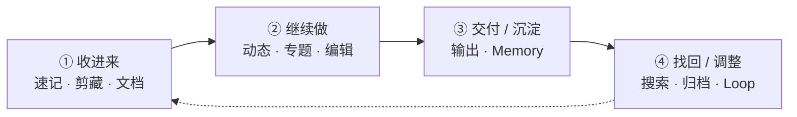
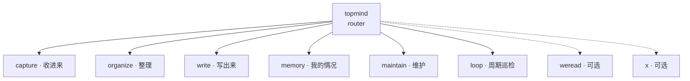

# topmind

[中文](README.md) · [English](README.en.md)

> **Agent 时代的本地优先个人知识工作台 · 个人 Stream。**  
> **随便记下** · AI 自动建议 / 整理 / 待办 / 记忆 · **你确认后再沉淀** · **文件永远是你的**。

---

### 💡 为什么做 topmind？

无论使用传统的纯笔记软件（如 Obsidian 等），还是近年来涌现的各种 AI 知识库、LLM Wiki 或知识图谱工具，使用下来总觉得缺了些什么。最根本的痛点在于：**知识维护过于繁琐，甚至本末倒置**——我们常常把大量精力浪费在目录分类、标签打标、格式化、双向链接等维护工作上，反而消耗了原本用于思考与创作的激情。

Topmind 的初衷就是打造一个**低摩擦、灵活且一站式**的个人知识与日常工作管理工具：

- **随时记录，零负担**：无论是突发的随笔想法、网页剪藏、文档抓取与格式转换，还是起草创作，都能一站式自然完成，不再为「放在哪里」而犹豫。
- **简单灵活，一站式体验**：兼顾个人轻量知识管理与日常工作流，随时随地保持极低摩擦。
- **AI 智能底座，主动而不打扰**：在开启 AI 时，系统能自动感知工作区上下文，主动给出恰到好处的知识整理与待办建议——**AI 负责建议与搬砖，用户掌握最终裁决权**。
- **开放扩展，连接多源**：渐进式对接外部优质知识源。例如结合微信读书开放 Skills 轻松同步划线与书评，后续也可拓展更多场景（如 X/推特书签与时间线归档等）。

**让工具回归辅助，让思考保持流动，文件永远属于你。**

```text
topmind  =  Portable Skills  ⊕  Optional Desktop  ⊕  Optional UTR
            可移植 AI 技能包      富工作台（可选）       CLI / MCP（可选）
```

三者**只共享内容约定与行为契约**，无强制运行时绑定。各表面有独立版本号（大版本对齐，小版本独立）：`npm run versions`。

| 表面 | 真源 | 作用 | 版本策略 |
|------|------|------|----------|
| **Skills** | [`skills/topmind-pack.json`](./skills/topmind-pack.json) | Agent 技能语义与路由 | 独立 |
| **Desktop** | [`topmind-desktop/package.json`](./topmind-desktop/package.json) | 本地富工作台 / 安装包 | 独立 |
| **剪藏扩展** | [`browser-extension/manifest.json`](./browser-extension/manifest.json) | 浏览器一键剪藏 | 独立 |
| **UTR** | [`utr/VERSION`](./utr/VERSION) | 可选 CLI / MCP（确定性命令） | 跟随 Desktop |
| Obsidian Plugin（未来） | `obsidian-plugin/manifest.json` | Obsidian 插件 | 预留 |

[Releases](https://github.com/topmindspace/topmind/releases) · [仓库](https://github.com/topmindspace/topmind)

---

## 为什么选 topmind

| 你要的 | topmind 怎么做 |
|--------|----------------|
| **个人 Stream** | 默认打开动态时间线；**随便记**，不必先分类建库 |
| **先记后分** | ⌘N / 动态「记下」写入本周周期本；不确定再进收件箱 |
| **文件即真源** | 标准 Markdown + 文件夹；可用任意编辑器打开，无专有库锁定 |
| **AI 可逆** | 建议默认可生成 · **确认后**再写 · 危险操作进 `99-归档/` |
| **一条建议入口** | 标题栏灯泡 + 有条目时顶条 → **全局建议面板** 确认（不挂两套列表） |
| **AI 待办 / Memory / 专题** | 活动窗口整理 · 清单 · 「我的情况」/周期摘要 · 内容大类专题 |
| **一条工作流** | 收进来 → 继续做 → 交付/沉淀 → 找回/调整 |
| **可拆可合** | 只用 Skills / 只用 Desktop / 再加 UTR，互不绑架 |

**五个用户概念（上限）**：**记一下 · 动态 · 专题 · 我的情况 · 写出来**。

UI 不教：protection、engine、UTR 命令名。设置用白话（「保存前问我」「重要文件不让 AI 直接改」）。

### 特色：AI 待办 · Memory · AI 建议

<p align="center">
  
</p>

| 能力 | 你怎么用 | 说明 |
|------|----------|------|
| **记一下** | 顶栏主 CTA · ⌘N | **唯一**完整捕获（笔记 / 链接 / 附件） |
| **记下** | 动态主区输入框 | 把输入追加到本周周期本（⌘↵） |
| **AI 润色** | 动态输入框旁 | 只改输入框 · 不落盘 · 不等于「记一下」 |
| **AI 待办** | 动态顶栏 / 侧栏 ✨ · ⌘⇧T | 从周期本提取待办 · 检测完成 · 可强制重试（`memory/todo.md`） |
| **Memory** | 侧栏「我的情况」 | `memory/profile.md`；建议确认后写入 |
| **AI 建议** | 标题栏灯泡 / 有条目时顶条 → SuggestPopover | **全局确认面**；软刷新不闪没；**确认后** apply |

**Token 可控**：设置 → 通用里可开关「自动准备 AI 建议」（默认开）与「自动 AI 整理待办」（**默认关**）。关后仅手动触发，避免后台耗 Token。状态栏用**单一语义 chip** 提示忙碌：仅整理待办时只显示「AI 整理待办中」（不叠「AI 工作中」）；对话流式 / 后台任务才亮「AI 工作中」；准备建议时显示「准备建议中」。

---

## 核心工作流

```text
收进来 -> 继续做 -> 交付/沉淀 -> 找回/调整
```



| 阶段 | 你做什么 | 默认落点 |
|------|----------|----------|
| **收进来** | 速记 · 网页剪藏 · Office/PDF 入队 | 本周**动态**周期本；不确定 → 收件箱 |
| **继续做** | 编辑 · 行内 AI · 侧栏 Agent · 整理专题 | `{类别}/{YYYY-主题}/` |
| **交付 / 沉淀** | 写出成品 · 确认后写入 profile / topics | `88-输出/` · `memory/` |
| **找回 / 调整** | 搜索 · 恢复 · 周期维护 | `99-归档/` · Loop |

**保存设置**：`writeback_mode: auto | confirm` — **自动保存**（落盘 + 回执）或 **审阅入口**（待确认写入 / SuggestPopover，接受后再落盘）。保护：`open` / `locked`。

---

## Skills：唯一日常入口 `topmind`

包内按意图分流，**不**另开并列前台入口。



| 类型 | 模块 | 职责 |
|------|------|------|
| **入口** | `topmind` | 意图路由 · 多意图拆分 |
| **动作** | `capture` · `organize` · `write` · `memory` · `maintain` · `loop` | 日常闭环 |
| **连接器** | `weread` · `x` | 可选外部源 |
| **共享** | `skills/shared/*` | 写回回执 · 长链 · 文档加工 · 降级 |

安装与 Host 适配：[`skills/INSTALL.md`](./skills/INSTALL.md) · 架构：[`SKILL-ARCHITECTURE.md`](./SKILL-ARCHITECTURE.md)

---

## Desktop 工作台一览

默认主叙事是 **动态**；三栏：**导航 · 内容 · AI 副驾**。

<p align="center">
  
</p>

<p align="center">
  
</p>

### 收进来 · 继续做 · 交付

<table>
  <tr>
    <td align="center" width="33%">
      <br/>
      <sub>收件箱整理</sub>
    </td>
    <td align="center" width="33%">
      <br/>
      <sub>智能捕获 / 抓取</sub>
    </td>
    <td align="center" width="33%">
      <br/>
      <sub>知识加工队列</sub>
    </td>
  </tr>
  <tr>
    <td align="center" width="33%">
      <br/>
      <sub>行内 AI（结果已清洗）</sub>
    </td>
    <td align="center" width="33%">
      <br/>
      <sub>侧栏 Agent · 待办与确认</sub>
    </td>
    <td align="center" width="33%">
      <br/>
      <sub>写出来 / 交付</sub>
    </td>
  </tr>
</table>

完整导览 → [`topmind-desktop/README.md`](./topmind-desktop/README.md) · 截图索引 → [`docs/images/README.md`](./docs/images/README.md)

---

## 三平面工作区

```text
{工作区}/
├── topmind.yaml              # 系统：行为契约
├── 00-收件箱/                # 内容：缓冲
├── 10-动态/                  # 内容：周期本（默认平铺）
├── 20-专题/2026-某主题/
│   └── topic.md
├── 88-输出/                  # 内容：扁平交付
├── 99-归档/                  # 内容安全层：backups · backups/trash · receipts
├── memory/                   # 语义：profile · periodic · topics
└── .topmind/                 # 系统：可删可重建的机器态
```

| 平面 | 路径 | 人记什么 |
|------|------|----------|
| **内容** | `{NN-名称}/` | 笔记 · 专题 · 输出 |
| **语义** | `memory/` | 稳定画像与周期沉淀 |
| **系统** | `topmind.yaml` + `.topmind/` | 契约 · 索引 · 日志 |

**6 条核心规约**：大类不重叠 · 专题自然涌现 · 动态类特殊 · 兜底清理 · 参考资料定位 · 类别命名稳定 — 详见 [`PROJECT-MODEL.md`](./PROJECT-MODEL.md)。

默认模板：`stream` · `balanced` · `research` · `periodic`。

---

## 能力状态（诚实）

| 能力 | 状态 |
|------|------|
| 捕获 · 编辑 · 剪藏 · 文档加工 | **Done** |
| skill-first AI · 建议条 · 待确认写入 | **Done** |
| Kernel 写闸 · Memory 闭环 · 动态主表面 | **Done** |
| 行内 AI 结果清洗（不写思考标签） | **Done** |
| 关键词搜索诚实截断 · **无** embedding 全库语义检索 | **Done**（有意） |
| AI 操作：todo 维护 · **记忆整理**（profile+periodic）· **专题建议**（内容大类 `create_topic`） | **Done**（confirm；活动窗口；不进 `memory/topics`） |
| 动态增补 · 活动窗口 · feed 安静建议 chip | **Done**（Wave S\* · 见 `docs/stream-first-optimization-scheme.md`） |

决策锁与阶段：[`docs/ARCHITECTURE-RESET.md`](./docs/ARCHITECTURE-RESET.md)

---

## 对比一瞥

| | Notion | Obsidian | 备忘录 | **topmind** |
|--|--------|----------|--------|-------------|
| 数据 | 云端 | 本地 MD | iCloud | **本地 MD** |
| 组织 | 库 / 页 | 双链 + 夹 | 文件夹 | **先记后分** |
| 抓取 | 扩展 | 插件 | 分享 | **内置加工队列** |
| AI | 内置 | 插件 | 系统 | **副驾 + 可逆写回** |

完整对比：[`docs/topmind-vs-others.md`](./docs/topmind-vs-others.md)

---

## 安装与开发

```bash
# Desktop
npm run desktop:dev
npm run desktop:pack:mac    # 或 :linux / :win

# Skills（装到 Host 技能目录）
npm run skills:install      # 详见 skills/INSTALL.md
npm run skills:test         # Skills 契约测试

# UTR（可选）
npm run utr:doctor
npm run utr:list            # 查看当前 UTR 动作域和命令（8 域 / 25 命令）

# 质量门
npm run validate            # secrets + docs + tests + desktop
npm run versions
```

| 我要… | 去哪 |
|-------|------|
| 桌面工作台 | [`topmind-desktop/README.md`](./topmind-desktop/README.md) |
| Agent Skills | [`skills/INSTALL.md`](./skills/INSTALL.md) · [`skills/README.md`](./skills/README.md) |
| CLI / MCP | [`TOOLS.md`](./TOOLS.md) · [`utr/README.md`](./utr/README.md) |
| 剪藏扩展 | [`browser-extension/README.md`](./browser-extension/README.md) |
| 三体边界 | [`PRODUCT-BOUNDARIES.md`](./PRODUCT-BOUNDARIES.md) |
| 内容模型 | [`PROJECT-MODEL.md`](./PROJECT-MODEL.md) |
| 产品交互 | [`DESIGN.md`](./DESIGN.md) |
| 打包 / CI | [`docs/PACKAGING.md`](./docs/PACKAGING.md) |
| 文档索引 | [`docs/README.md`](./docs/README.md) |

---

## 文档地图

| 文档 | 用途 |
|------|------|
| [ARCHITECTURE-RESET](./docs/ARCHITECTURE-RESET.md) | 决策锁 · 阶段 · 诚实表 |
| [PRODUCT-BOUNDARIES](./PRODUCT-BOUNDARIES.md) | Skills / Desktop / UTR 边界 |
| [PROJECT-MODEL](./PROJECT-MODEL.md) | 数据模型 · 6 条规约 |
| [DESIGN](./DESIGN.md) | 产品交互 · 用户概念 ≤5 |
| [SKILL-ARCHITECTURE](./SKILL-ARCHITECTURE.md) | Skills 包结构 |
| [TOOLS](./TOOLS.md) | UTR 命令面 · 写回契约 |
| [AGENTS](./AGENTS.md) | Agent 行为纪律 |
| [SECURITY](./SECURITY.md) | 安全与密钥边界 |

---

Repo: [github.com/topmindspace/topmind](https://github.com/topmindspace/topmind) · License: MIT
