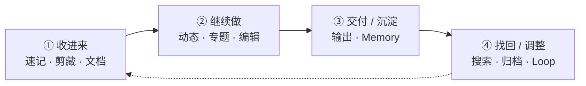

# topmind

[English](README.md) · [简体中文](README.zh-CN.md)

[](https://github.com/topmindspace/topmind/releases)
[](LICENSE)
[](https://nodejs.org)
[](#快速上手与安装入口)
[](https://github.com/topmindspace/topmind/actions)

> **Agent 时代的本地优先个人动态流与知识工作台 · Personal Stream**  
> **随便记下** → **AI 自动建议 / 整理 / 待办 / 记忆** → **用户确认后再沉淀** → **文件永远属于本地**

---

## 界面与全流程演示

### 动态主表面（Stream 与 AI 建议）

<p align="center">
  
</p>

### 全流程动态演示

<p align="center">
  
</p>

<p align="center">
  <sub>如果环境无法自动播放，可下载或用本地播放器打开 <a href="./docs/images/topmind-demo.mp4">HD MP4 高清演示视频</a>。</sub>
</p>

---

## 为什么选择 topmind？

使用传统笔记（如 Obsidian、Logseq）或现代 AI 知识库时，最常见的负担是**维护成本过高**——精力往往被耗在分类、打标签、调格式和维护双链上，而非思考本身。

topmind 提供**极低摩擦**的个人动态流工作台：

- **随手记录，无分类负担**：想法、网页剪藏、文档解析与起草，随手记下，不必在动笔前纠结“该放哪里”。
- **先记后分，动态流优先**：默认主界面是时间轴动态流。随手记录，主题反复涌现时再沉淀为专题。
- **主动且克制的 AI**：系统感知工作区上下文，主动准备恰到好处的整理与待办建议——**AI 提建议并承担琐碎操作，你做最终裁决**。
- **本地优先，文件即真源**：纯标准 Markdown 与文件夹存储，数据 100% 留存在本地磁盘，无专有数据库绑定。

---

## 快速上手与安装入口

topmind 由四个核心表面与一个剪藏 companion 扩展组成。根据工作流习惯选择入口：

```text
topmind  =  Portable Skills  ⊕  Optional Desktop  ⊕  Optional UTR  ⊕  Optional Obsidian
            AI 技能包（Agent）    富工作台（独立应用）    CLI / MCP 工具         Vault 内嵌插件
          + Optional Clip 剪藏分发面（Desktop 捕获 companion，非独立 Kernel 宿主）
```

### 场景 1：独立桌面工作台（topmind Desktop）

> 适用：需要独立富文本应用与可视化 AI 确认界面。

- **方式 A：Homebrew 快捷安装（macOS 推荐 · 一键解隔离）**：
  ```bash
  brew install topmindspace/tap/topmind
  ```
  *通过 Homebrew 安装会自动清理 macOS `quarantine` 属性，免去未签名应用的“已损坏无法打开”报错。*

- **方式 B：手动下载安装包**：
  1. 前往 [Releases](https://github.com/topmindspace/topmind/releases) 下载适用于你系统的安装包（`.dmg` / `.exe` / `.AppImage` / `.deb`）。
  2. 安装并打开，快捷键 `⌘N`（Mac）/ `Ctrl+N`（Win/Linux）随时记一条。  
     *（macOS 若手动安装提示损坏打不开，可在终端运行：`sudo xattr -rd com.apple.quarantine /Applications/Topmind.app`）*
  3. 详细指南：[`topmind-desktop/README.zh-CN.md`](./topmind-desktop/README.zh-CN.md) · [English](./topmind-desktop/README.md)

### 场景 2：在 Obsidian 中使用（topmind Stream 插件）

> 适用：希望在现有 Obsidian Vault 中直接使用动态流。

- **方式 A：Obsidian 官方社区插件市场**：
  *（官方社区插件审核发布中）* 上架后可在 Obsidian **设置 ➔ 社区插件 ➔ 浏览** 搜索 `topmind stream` 一键安装。
- **方式 B：BRAT 插件一键安装**：
  在 Obsidian BRAT 插件中添加 GitHub 仓库 `topmindspace/topmind`。
- **方式 C：手动解压安装**：
  从 [Releases](https://github.com/topmindspace/topmind/releases) 下载 `topmind-obsidian-<ver>.zip` 解压至 `<Vault>/.obsidian/plugins/topmind-stream/`。
- 打开插件后，在 Obsidian 中按 `⌘P` / `Ctrl+P` 打开命令面板，运行 **Topmind: 打开动态**。
- 详细指南：[`obsidian-plugin/README.zh-CN.md`](./obsidian-plugin/README.zh-CN.md) · [English](./obsidian-plugin/README.md)

### 场景 3：为 Agent（Claude Code / OpenCode / Codex）导入 Skills

> 适用：使用 AI Agent 驱动本地工作流。

- **路径 A（社区 CLI & skills.sh）**：
  ```bash
  npx skills add topmindspace/topmind -g -y
  ```
- **路径 B（Desktop 界面一键管理 · 已装 Desktop 时推荐）**：  
  打开 Desktop ➔ **设置 ➔ 管理与更新**：系统自动探测本机 Claude Code / OpenCode / Codex 等宿主，点击一键安装 Skills 到宿主全局。
- **路径 C（源码 CLI）**：
  ```bash
  npm run skills:install        # 或 node scripts/install-skills.mjs add topmindspace/topmind -g
  ```
- 详细指南：[`skills/README.zh-CN.md`](./skills/README.zh-CN.md) · [`skills/INSTALL.md`](./skills/INSTALL.md) · [`SKILL-ARCHITECTURE.md`](./SKILL-ARCHITECTURE.md)

### 场景 4：浏览器剪藏（Clip Extension）

> 适用：网页一键抓取与正文加工。

1. 从 Desktop **设置 ➔ 管理与更新** 点击“准备剪藏扩展”解压托管目录，按引导在 Chrome/Edge 中以“加载已解压的扩展”安装。
2. 或直接从 [Releases](https://github.com/topmindspace/topmind/releases) 下载 `topmind-clip-extension-<ver>.zip` 手动加载。
3. 详细指南：[`browser-extension/README.zh-CN.md`](./browser-extension/README.zh-CN.md) · [English](./browser-extension/README.md)

### 场景 5：Terminal 命令行与 MCP 服务器（UTR CLI / MCP）

> 适用：需要在 Terminal 或 MCP Server 环境中运行确定性工具。

- 随 Desktop 安装包一并打包分发，或在本地仓库直接使用源码 `utr/` 目录。
- 查看当前 UTR 动作域和命令：
  ```bash
  npm run utr:doctor            # UTR 工具链诊断
  npm run utr:list              # 查看当前 8 域 / 28 命令
  ```
- 详细指南：[`TOOLS.md`](./TOOLS.md) · [`utr/README.zh-CN.md`](./utr/README.zh-CN.md) · [English](./utr/README.md)

---

## 核心工作流

```text
收进来 -> 继续做 -> 交付/沉淀 -> 找回/调整
```



| 阶段 | 用户动作 | 默认落点 | 说明 |
|------|----------|----------|------|
| **① 收进来** | 快捷键速记 · 网页剪藏 · Office/PDF 入队 | 本周**动态**周期本（`10-动态/` 或现场 `role:loose-stream`）；不确定 ➔ 收件箱（`00-收件箱/` / `role:buffer`） | 零摩擦极速捕捉 |
| **② 继续做** | 编辑 · 行内 AI · 侧栏 Agent · 整理专题 | `{大类}/{YYYY-主题}/` | 动态卡片流与专题沉淀 |
| **③ 交付 / 沉淀** | 写出成品 · 确认后写入 profile / topics | `88-输出/` · `memory/profile.md` | 产出成品文件，更新个人画像 |
| **④ 找回 / 调整** | 搜索 · 恢复 · 我的情况浏览 · 周期维护 | `99-归档/` · `memory/` · Loop 巡检 | 安全归档、记忆平面浏览与快速检索 |

---

## 三平面目录模型

topmind 将工作区组织为清晰的三个平面，逻辑自洽且可预测：

```text
{工作区}/
├── topmind.yaml              # 系统平面：行为契约与门面配置
├── 00-收件箱/                # 内容平面：临时缓冲（或 00-Inbox / 现场 role:buffer）
├── 10-动态/                  # 内容平面：周期本（按年分组 {YYYY}/周期本.md）
├── 20-专题/2026-某主题/       # 内容平面：涌现专题目录
│   └── topic.md              # 专题首页
├── 88-输出/                  # 内容平面：扁平交付文件
├── 99-归档/                  # 内容平面安全层：backups · backups/trash · receipts
├── memory/                   # 语义平面：profile（画像）· periodic（反思）
└── .topmind/                 # 系统平面：索引与日志（可随时删除与重建）
```

目录名跟随现场契约。英文名如 `00-Inbox` / `99-Archive` 与中文默认同等有效。

**6 条核心规约**（[`PROJECT-MODEL.md`](./PROJECT-MODEL.md) §3）：大类不重叠；专题自然涌现；动态类默认平铺；兜底类约 30 天清理；参考资料定位明确；大类命名稳定（改名走 migration）。

---

## 核心能力诚实表

| 能力 | 状态 | 说明 |
|------|------|------|
| 捕获 / 周期本 / 编辑 / 剪藏 / 知识加工 | **Done** | 零摩擦流式记录；Desktop 默认 anydoc 转 MD（可选 markitdown/pandoc + 内置兜底） |
| Kernel 写闸 · Memory 分层体系 · 动态主表面 | **Done** | 确认后再落盘，高影响改动可撤销与恢复 |
| 行内 AI 结果清洗 | **Done** | 自动过滤与清洗思考标签（Thought Tags） |
| 关键词搜索诚实截断 · **无** embedding 全库语义检索 | **Done** | 保持轻量与透明，防全库泛滥 |
| AI 操作：todo 维护 · 记忆整理 · 专题建议 | **Done** | 活动窗口驱动，confirm 路径安全控制 |
| 可选记账（`memory/ledgers/`） | **Done** | ledger-engine 卫星；Skills `topmind-ledger`；Desktop 启用后小应用 — 不是第六个用户概念 |
| 多路 AI 串行与独立会话 | **Done** | 后台 Prep 串行，Agent streaming 时让路 |

---

## 四体核心 + Clip 分发面与版本真源

**四体核心**（[`PRODUCT-BOUNDARIES.md`](./PRODUCT-BOUNDARIES.md)）：Skills · Desktop · UTR · Obsidian — 共享内容约定与行为契约。**Clip Extension** 为 Desktop 捕获 companion 分发面（非独立 Kernel 宿主）。各表面独立版本管理（大版本对齐，小版本独立）；对外一个产品 tag `v*` = 一个 GitHub Release。运行 `npm run versions` 查看：

- **Skills**: [`skills/topmind-pack.json`](./skills/topmind-pack.json)（详情参阅 [`skills/README.zh-CN.md`](./skills/README.zh-CN.md)）
- **Desktop**: [`topmind-desktop/package.json`](./topmind-desktop/package.json)（详情参阅 [`topmind-desktop/README.zh-CN.md`](./topmind-desktop/README.zh-CN.md)）
- **UTR**: [`utr/VERSION`](./utr/VERSION)（详情参阅 [`TOOLS.md`](./TOOLS.md)）
- **Obsidian**: [`obsidian-plugin/manifest.json`](./obsidian-plugin/manifest.json)（详情参阅 [`obsidian-plugin/README.zh-CN.md`](./obsidian-plugin/README.zh-CN.md)）
- **Clip Extension**: [`browser-extension/manifest.json`](./browser-extension/manifest.json)（详情参阅 [`browser-extension/README.zh-CN.md`](./browser-extension/README.zh-CN.md)）

---

## 本地构建与开发

```bash
git clone https://github.com/topmindspace/topmind.git
cd topmind

npm run desktop:dev         # 启动 Desktop 开发环境
npm run skills:test         # 运行 Skills 测试
npm run validate            # 全量质量门
npm run versions            # 打印各表面当前版本号
```

需要 **Node.js ≥ 20.11**。

---

## 全局文档地图

| 想要了解… | 对应文档 |
|-----------|----------|
| 架构决策锁与诚实状态 | [`docs/ARCHITECTURE-RESET.md`](./docs/ARCHITECTURE-RESET.md) |
| 表面能力与硬边界 | [`PRODUCT-BOUNDARIES.md`](./PRODUCT-BOUNDARIES.md) |
| 数据模型与 6 条核心规约 | [`PROJECT-MODEL.md`](./PROJECT-MODEL.md) |
| UI/UX 产品设计交互 | [`DESIGN.md`](./DESIGN.md) |
| Desktop 富工作台说明 | [`topmind-desktop/README.zh-CN.md`](./topmind-desktop/README.zh-CN.md) · [English](./topmind-desktop/README.md) |
| Obsidian 插件说明 | [`obsidian-plugin/README.zh-CN.md`](./obsidian-plugin/README.zh-CN.md) · [English](./obsidian-plugin/README.md) |
| Agent Skills 架构与安装 | [`SKILL-ARCHITECTURE.md`](./SKILL-ARCHITECTURE.md) · [`skills/INSTALL.md`](./skills/INSTALL.md) |
| UTR CLI/MCP 命令字典 | [`TOOLS.md`](./TOOLS.md) · [`utr/README.zh-CN.md`](./utr/README.zh-CN.md) |
| 浏览器剪藏扩展说明 | [`browser-extension/README.zh-CN.md`](./browser-extension/README.zh-CN.md) · [English](./browser-extension/README.md) |
| 打包发布与 CI/CD 说明 | [`docs/PACKAGING.md`](./docs/PACKAGING.md) |
| 全局文档索引中心 | [`docs/README.zh-CN.md`](./docs/README.zh-CN.md) · [English](./docs/README.md) |

**README 约定：** 各模块以 `README.md` 为英文主文档（GitHub 默认），`README.zh-CN.md` 为简体中文。

---

## 开源协议

[MIT License](LICENSE) © [TopMindSpace](https://github.com/topmindspace)
