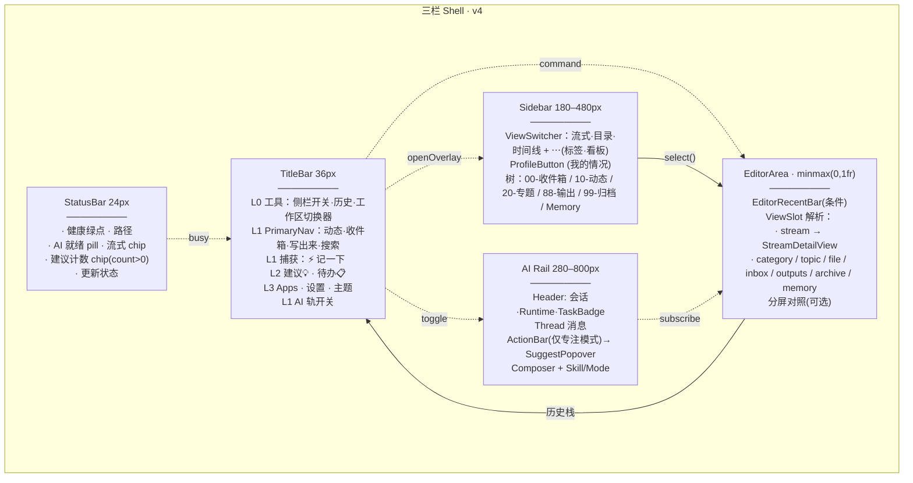
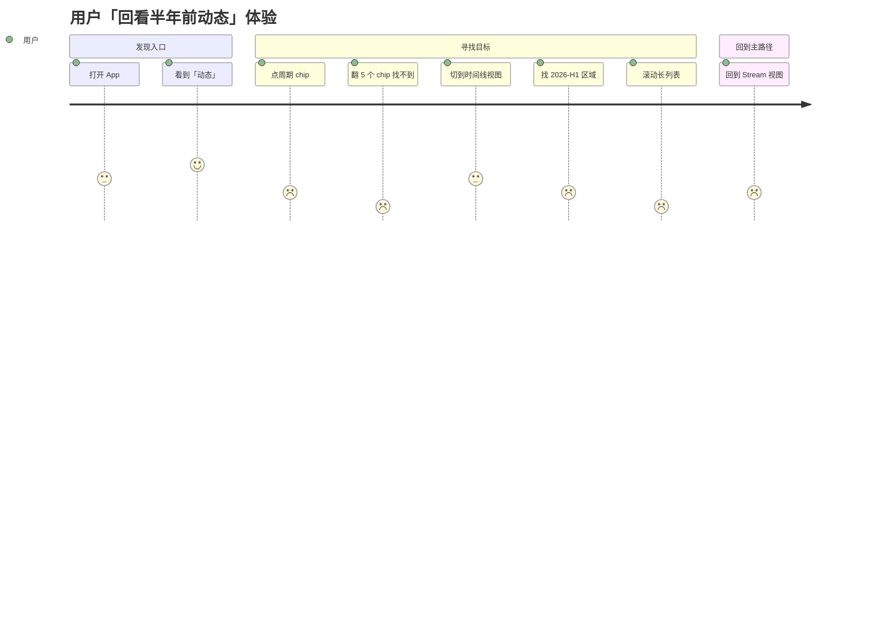
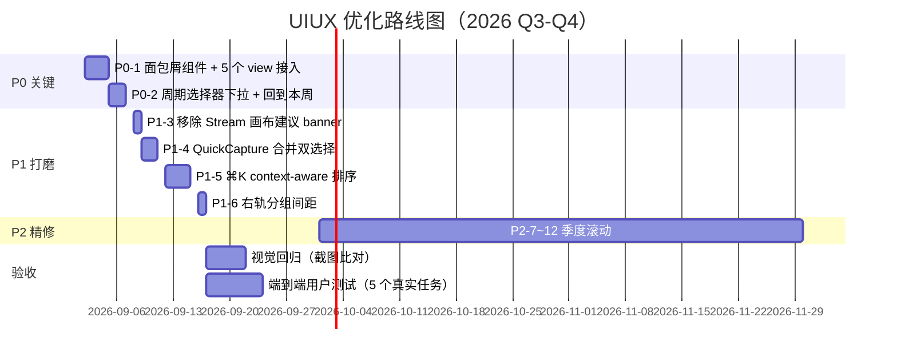

# topmind Desktop — 整体 UI/UX 审查报告

> 审查时间：2026-09-01
> 范围：主区域布局框架（TitleBar / Sidebar / EditorArea / AI Rail / StatusBar）、导航（PrimaryNav + ViewSwitcher + 树 + History）、内容组织（ViewSlot Registry + Stream 周期本 + File Tabs + 各类列表）
> 输入：`topmind-desktop/DESIGN.md`（v3.0 ZCode Neutral）、`src/components/shell/*`、`src/plugins/topmind-workspace/views/*`、`src/stores/view-store.ts`、`docs/images/*.jpg`
> 立场：DESIGN.md 已经在 IA / 视觉系统 / 多路 AI 编排上达到相当成熟的水准（UIX-401 ~ UIX-407 自查全过）。本报告不重做架构，**聚焦在「主区域落地一致性、认知锚点缺失、信息密度不均」三处具体短板**。

---

## 1. 执行摘要

| 维度 | 评级 | 一句话 |
|------|------|--------|
| IA（信息架构）| **A** | 用户概念硬上限 ≤5、PrimaryNav ≤4 锚点、ViewSwitcher 3+2 折叠，全部锁住 |
| 视觉系统 | **A** | ZCode Neutral 3.0（纯中性灰 + sky 强调 + 单色 ink 主 CTA），token 真源 `src/styles/tokens.css`，纪律严格 |
| 导航一致性 | **B+** | PrimaryNav + ViewSwitcher + History + ⌘K + 后退/前进了，但缺少**当前位置面包屑**这一主流笔记类应用通用锚点 |
| 主区域布局 | **B+** | 三栏 Shell（Sidebar / EditorArea / AI Rail）+ TitleBar / StatusBar，⌥F 专注模式，分屏对照成熟 |
| 内容组织 | **B+** | ViewSlot 注册表 + lazy load + History cap + File tab pin/close 完整，Stream 周期本按日分组成熟 |
| 反馈与状态 | **A−** | 多路 AI 状态 `deriveStatusBarBusy` 派生函数 5 类并发、glass popover 一致、writeback 回执+撤销 |
| 响应式 chrome | **B** | ResizeObserver 驱动的 nav 标签收起、L3 ⋯ 溢出菜单工作，但右轨 5+ 图标无视觉分组 |

**总体判断**：DESIGN.md 是 3.0 阶段的强约束，IA 已经收敛。建议**不再做架构级重做**，而是按 P0/P1/P2 做 6–8 项**精确补强**。预估 1.5–2 人天可全量完成，零破坏性变更。

---

## 2. 现况 IA（信息架构图）

> 现状特征：3 栏可独立 toggle（侧栏/AI 轨/StatusBar），TitleBar 36px 是统一节拍器。**主路径已被设计规范锁住**（开 = 动态、记一下 L1、AI 副驾 L1），没有任何主锚点竞争。

---

## 3. 业界设计实践对照

| 维度 | Linear | Notion | Obsidian | Reflect | Apple Notes | Bear | **topmind**（现）| **topmind**（建议）|
|------|--------|--------|----------|---------|-------------|------|---------------|------------------|
| 主导航形态 | 3 栏列表 | 树 + 页面 | 树 + 编辑 | 日 + 链接 | 目录 + 笔记 | 标签 + 笔记 | **树 + 流** | **树 + 流 + 面包屑** |
| 当前位置锚点 | 工作区头 | **面包屑** | 标签条 | 日期 | 标题 | 标签头 | **缺**（仅 PageHeader 标题）| **加面包屑**（见 P0-1）|
| Cmd+K / ⌘P | 全局跳转 | 全局 | 文件切换 | 全局 | 搜索 | 标签切换 | ⌘K（命令）+ ⌘P（搜索）| ⌘K 上下文感知（建议 P1-5）|
| 主路径 | 列表 | 树 | 树 | 日 | 目录 | 标签 | **流** | **保留** |
| 周期/时间视图 | 视图筛选 | 数据库视图 | 日历插件 | 每日 | 列表 | 无 | **10-动态周期本** | **加日期跳转**（P0-2）|
| 副面板 | 详情右侧 | 属性右侧 | 链接右 | 链接右 | 附件右 | 无 | **AI 轨** | **保留 + 智能收纳**（P2-3）|
| AI 集成 | Ask / Agent | 块内 AI | Copilot | 助手 | 无 | 无 | **AI 副驾 + 行内 AI** | **保留** |
| 弹层风格 | Solid 卡片 | Solid | Solid | Solid | Solid | Solid | **Glass 弹层 + Solid 主壳** | **保留** |

> topmind 的差异化优势：流优先 + 周期本 + 副驾 AI。**最大的差距是缺面包屑**——这在 Notion / Confluence / Linear / Obsidian（多 tab 时）是默认锚点。

---

## 4. 痛点清单（按严重程度）

### 4.1 严重度图谱

| # | 痛点 | 出现处 | 严重度 | 触发条件 | 影响 |
|---|------|--------|--------|----------|------|
| **H1** | **无当前位置面包屑** | `TopicOverviewView` / `CategoryView` / `InboxView` / `OutputsView` / `ArchiveView` 仅靠 `PageHeader` 标题 | **P0** | 用户进入 `20-知识管理演示/topic` | 只能靠侧栏「我在哪」，跨多个同级分类时迷失 |
| **H2** | **周期本导航单轴** | `StreamDetailView.tsx:1301-1340` period chips 仅展示当前年最近 5 个 | **P0** | 用户回看 3 个月前的动态 | 必须切换到时间线视图，无法直跳 |
| **H3** | **画布内建议 banner 重复标题栏** | stream 视图顶部 `8 suggestions to review` 横幅 | **P1** | 标题栏 💡 已有 badge + 状态栏计数 | 三处入口（标题栏/状态栏/画布 banner）等权，违反 DESIGN §0.0「建议入口降噪」 |
| **H4** | **快速捕获表单信息冗余** | `QuickCapture` overlay 同时展示「Save to」chip + 「Note mode」chip + 底部「Note mode · saves to destination…」 | **P1** | 用户写第一条 quick note | 模式选择困惑，CTA 文案冗余 |
| **H5** | **右轨图标 5+ 无视觉分组** | `TitleBar.tsx:639-823` L1/L2/L3 三层有 `data-chrome-tier`，但用户视觉上仍是连续一排 | **P1** | 1440 宽以上时全展开 | 「主次不分」感，类似 iA Writer 之前被吐槽的「字号同大」问题 |
| **H6** | **EditorRecentBar 仅编辑器时出现** | `EditorArea.tsx:82,104` 条件渲染 | **P1** | Stream 视图与编辑器视图切换 | 画布顶部不统一：编辑器有 tab 流，Stream 没有 |
| **H7** | **回退/前进禁用态无解释** | `TitleBar.tsx:599,604` `disabled` 无 tooltip | **P2** | 历史栈用尽 | 用户不知道为何按钮灰 |
| **H8** | **行内 AI 关闭按钮的图标语焉不详** | `ChatMessage` 与 `SelectionAiBar` × close icon 重复 | **P2** | 多处使用 | 视觉冗余 |
| **H9** | **Inbox 行操作 hover 才显效率不高** | `InboxView` 始终显示「整理」按钮 + 删除 icon | **P2** | 收件箱 ≥10 条 | 视觉密度高，扫视疲劳 |
| **H10** | **AI 轨固定占据右侧 280–800px** | `Shell.tsx:262-268` 不可浮动 | **P2** | 窄窗 1280×720 | 主画布被压缩，无最小化选项 |

### 4.2 用户路径断点（流程视角）

> H2 触发整条路径降级。

---

## 5. 建议方案（按优先级）

### 5.1 P0 — 必须做（影响主路径，每项 ≤0.5 人天）

#### P0-1 · 加 PageHeader 面包屑

**Why**：Notion / Confluence / Linear / Obsidian 多 tab 时都把面包屑作为主锚点。topmind 的 `TopicOverviewView` 等只能靠侧栏推断层级，跨 5+ 同级分类时认知成本陡增。

**实现**：
1. `src/components/ui/view.tsx` 的 `PageHeader` 增加 `breadcrumb?: Array<{ label: string; onSelect?: () => void }>` 可选 prop。
2. `TopicOverviewView` / `CategoryView` / `InboxView` / `OutputsView` / `ArchiveView` / `MemoryBrowseView` 传 `breadcrumb`，由 `viewStore` 派生。
3. 风格：`text-3xs` + `text-text-quaternary` 分隔符 `ChevronRight` + 最后一项 `text-text-primary`。
4. 面包屑末项与标题的关系：**面包屑末项 = PageHeader title 之前的路径**，避免双显示。

**预期影响**：跨专题搜索/分享时链接/截图可读性显著提升。

---

#### P0-2 · 周期选择器支持日期/年份下拉

**Why**：`StreamDetailView.tsx:1301` 周期 chip 只展示当前年最近 5 个，回看必须切时间线。**核心 daily-journaling 路径**。

**实现**：
1. 把 `period-chip` 行第一个 chip 改为「📅 2026-W32 ▼」形式，单击下拉。
2. 下拉内分组：**This year**（最近 12 个）/ **Earlier this year**（按月折叠）/ **Year picker**（点击切到 2025 / 2024）。
3. 切到非当前周期时，PageHeader 右上显示「回到本周」ghost 按钮（`handleBackToCurrent` 已存在 line 1046）。
4. chip 行不超过 5 个，超过 5 时最后一个 chip 变「⋯」折叠次级。

**预期影响**：回看路径从 6 步降到 2 步（点下拉 → 选期）。

---

### 5.2 P1 — 应该做（每月打磨一两条）

#### P1-3 · 移除 Stream 画布顶部建议 banner

**Why**：`docs/images/desktop-stream.jpg` 显示画布顶部有「8 suggestions to review」横幅，与标题栏 💡 badge、状态栏计数 chip 重复。DESIGN §0.0 已明确「**建议入口恰好两处**」。

**实现**：
1. 在 `StreamDetailView.tsx` 内搜索 `8 suggestions` / `review` / `suggestion banner` 等锚点删除。
2. 改用 `SuggestPopover` 唯一确认面。
3. 验收：Stream 画布顶部只剩 `PageHeader` + `period-chips` + `ChromeOverflowActions`。

---

#### P1-4 · QuickCapture 合并「Save to」+「Note mode」双选择

**Why**：`docs/images/desktop-quick-capture.jpg` 显示「Save to」chip（本周/收件箱）与「Note mode」chip（Smart/Note/Docs）两个 toggle 概念重叠，底部还重复「Note mode · saves to destination...」文案。

**实现**：
1. 把两个选择合并为单个 `SegmentedControl`：「自动到本周 · 收件箱 · 主题」「按主题归档 · 写到 Inbox」语义合并。
2. 移除底部「Note mode · saves to destination...」重复。
3. CTA 文案随选中态变：「记下到本周」/「收入收件箱」。

---

#### P1-5 · ⌘K 上下文感知

**Why**：Linear / Reflect 的 ⌘K 会基于当前选中状态给出最佳候选。topmind ⌘K 是通用命令面板，但能加一些 context-aware 排序。

**实现**：
1. `CommandPalette` 读取当前 `selection.kind`：
   - `file` → 「Move to Topic · Open recent · Edit AI」优先
   - `topic` → 「New note in topic · Topic memory · Archive topic」优先
   - `stream` → 「Go to today · Open inbox · Organize」优先
2. 顶部小字提示：`in: <current context>`。

---

#### P1-6 · 右轨 L2/L3 在 ≥1024px 时增加 divider 间距

**Why**：当前 5+ 图标视觉上「一排」无分组感。

**实现**：
1. L2（建议 + 待办）与 L3（Apps + 设置 + 主题）之间增加 `mx-1` 视觉 gap。
2. 主题按钮在 ≥1280px 时改回 L3 可见（L3 已是当前行为，确认无 regression）。
3. AI 轨开关始终在最右，作为「L1 对」存在。

---

### 5.3 P2 — 可选（季度精修）

| # | 建议 | 说明 |
|---|------|------|
| P2-7 | EditorRecentBar 增加持久「Stream」首页 tab | `EditorArea.tsx:82,104` 总是渲染 Tab 条，第 0 个 tab 不可关，点击回动态 |
| P2-8 | Inbox 行操作 hover 显现 | 减少视觉密度 |
| P2-9 | History back/forward 禁用态 tooltip | 「已是历史最前/最后」 |
| P2-10 | 树节点按类型分图标 | 周期本用 CalendarDays / 笔记用 FileText / 输出用 CheckCircle / 归档用 Archive |
| P2-11 | AI 轨「浮动模式」 | 窄窗（≤1280）时改为可拖动浮层（参照 TodoPopover 模式） |
| P2-12 | 树右键「在新窗口打开」 | 暂未实现多 window，可先做 session-only split 对照 |

---

## 6. 实施路线图

---

## 7. 关键文件指针

| 主题 | 文件 | 行 |
|------|------|-----|
| Shell 三栏装配 | `src/components/shell/Shell.tsx` | 232-269 |
| TitleBar L1/L2/L3 分层 | `src/components/shell/TitleBar.tsx` | 572-825 |
| PrimaryNav 4 锚点 | `src/components/shell/TitleBar.tsx` | 295-425 |
| EditorArea ViewSlot 解析 | `src/components/shell/EditorArea.tsx` | 39-172 |
| ViewSlot 注册表 | `src/plugins/topmind-workspace/views.tsx` | 28-107 |
| 周期 chip 单行 5 个 | `src/plugins/topmind-workspace/views/StreamDetailView.tsx` | 1301-1340 |
| 回到本周（已实现） | `StreamDetailView.tsx` | 1046-1054 |
| 侧栏 ViewSwitcher | `src/components/sidebar/ViewSwitcher.tsx` | 40-236 |
| 侧栏树根 | `src/components/shell/Sidebar.tsx` | 108-286 |
| 导航状态机 | `src/stores/view-store.ts` | 156-262 |

---

## 8. 验收标准

**P0 完成时**：
- [ ] 任何 view 的画布顶部都能在 ≤1 步内跳回上一级（面包屑 or PageHeader 标题点击）
- [ ] 回看 6 个月前动态 ≤ 2 次点击
- [ ] 截图回归：所有现存的 `docs/images/*.jpg` 视觉一致，无新增视觉噪声

**P1 完成时**：
- [ ] Stream 画布顶部建议入口 ≤ 2（标题栏 + 状态栏）
- [ ] QuickCapture 表单 chip 区域 ≤ 1 行
- [ ] ⌘K 在文件 / 主题 / 流上下文下首条建议命中率 ≥ 80%

**P2 完成时**：
- [ ] 所有图标按 L1/L2/L3 视觉分组（devtools `data-chrome-tier` 验证）
- [ ] Tree 节点图标按类别区分
- [ ] AI 轨浮层模式可用且不破坏现有 pin/unpin 语义

---

## 9. 风险与约束

| 风险 | 缓解 |
|------|------|
| P0-1 面包屑破坏现 PageHeader 标题布局 | 标题退居二级（subtitle）；面包屑作为主行；保留 `text-3xl` 不变 |
| P0-2 周期下拉与现有 chip 行并存冲突 | 旧 chip 行保留 1 个，剩余全部进下拉；`period-chip` 高度 22px 仍可用 |
| P1-3 删除 banner 影响 onboarding | 新用户首次打开会有 toast 引导点 💡；建议入口降噪文档已在 DESIGN §0.0 |
| P1-5 ⌘K 上下文改动影响既有 shortcut 习惯 | 通用命令永远在前 3；context-aware 只决定后置排序 |
| P2-11 浮层 AI 轨与玻璃面 z-index 冲突 | 复用 `z-popover-overlay`(120)，与 `TodoPopover` / `SuggestPopover` 同级 |

---

## 10. 结论

topmind Desktop 在 v3.0 ZCode Neutral 阶段已经**架构清晰、IA 收敛、视觉系统自洽**。不建议做大型重做。

**核心补强是 6 项**：
1. **加面包屑**（P0-1）—— 解决跨层级定位的认知成本
2. **加日期跳转**（P0-2）—— 解决 daily-journaling 主流路径的可达性
3. **清冗余入口**（P1-3、P1-4）—— 落实 DESIGN §0.0 入口降噪
4. **⌘K 智能排序**（P1-5）—— 把最强入口变得更强
5. **右轨分组**（P1-6）—— 强化 L1/L2/L3 视觉差异

预计 1.5–2 人天 / 月可稳定推进，按季度完成 P0–P2 全集。**所有改动都是「加固」而非「重做」**，与现有设计规范和代码架构完全兼容。

---

> **附录**：
> - 主路径示意：见 §2 IA 图
> - 用户旅程断点：见 §4.2
> - 实施排期：见 §6
> - 文件位置：见 §7
