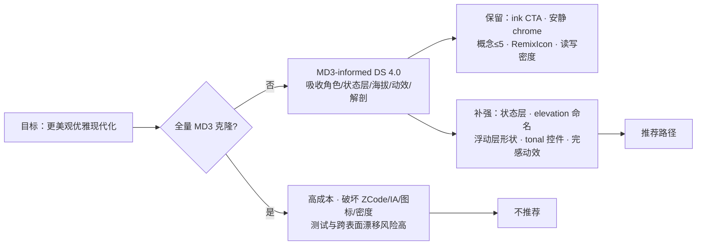

# topmind Desktop — MD3 评估与 Design System 4.0 改造方案

> **状态**：已落地 Wave 0–2 + 4.0.1–4.0.3 + **4.1 设置 IA / 记账一站化** · 2026-09-17  
> **现行真源**：`topmind-desktop/DESIGN.md` + `tokens.css`  
> **对照**：Material Design 3 / Material You / Material 3 Expressive（m3.material.io · Wikipedia · Google Blog · material-color-utilities）  
> **立场**：**不以全量 MD3 重写为目标**。在既有 ZCode Neutral 3.0 产品身份上，**选择性吸收** MD3 的角色色模型、状态层、动效与组件解剖，做「更美观优雅现代化」的系统升级。

---

## Identity

**Product UI Designer**（工作台 / 密集编辑器 / AI 副驾）——先问「用户 90% 时间处在哪个状态」，再决定视觉语言。

## Grounding

**Junior Designer 假设（已定，不停下追问）**：

- topmind Desktop 是 **Electron 个人工作台**，不是 Android 应用，也不是营销站。
- 美学身份已锁定为 **Design System 3.0 — ZCode Neutral**：纯中性石墨 × sky 强调 × **单色 ink 主 CTA** × Linear 密度 × Craft 长时阅读。
- 目标用户 90% 时间在：**动态信息流** → 写/增补 → 看 AI 建议 → 确认沉淀。次高频：编辑器长文、侧栏树、状态栏 AI 状态。
- 本方案**故意推迟**：壁纸动态取色、Navigation Rail 重构、FAB 捕获、Material 默认紫。  
- 现行 `DESIGN.md` 是 Taste 层；本文只产出 **delta + 整改路线**，不替换它。

---

## 1. MD3 是什么（研究结论）

Material Design 3（2021，Material You）与 Material 3 Expressive（2025）构成当前 Google 设计语言。对本产品真正可借鉴的，是下面这套**系统骨架**，不是「看起来像 Pixel」的皮。

### 1.1 核心骨架

| 层 | MD3 主张 | 对 topmind 的意义 |
|----|----------|-------------------|
| **色彩角色** | 不用散落 hex，而用 **语义角色**：`primary / on-primary / primary-container / on-primary-container / secondary / tertiary / surface / surface-variant / outline / error…`；每角色从 **tonal palette（0–100 tone）** 取值 | topmind 已有语义 token（surface 阶梯 / accent / status），但**角色命名更偏「用途词」而非 MD3 角色图**；可做映射层，不必改色相 |
| **色科学** | HCT（hue / chroma / tone）+ contrast 工具；从 seed 生成整套 scheme | 已有手调 sky 轴 + **实测 AA 测试**。不必上 `material-color-utilities` 运行时；可在设计阶段用 Theme Builder **校验停位** |
| **动态色** | 从壁纸/种子生成主题 | **桌面工作台低优先级**。可选：设置里「主题种子」生成 2–3 套 scheme，默认仍固定品牌 sky |
| **排版** | Display / Headline / Title / Body / Label 大阶，强调对比 | topmind 是 14px 基座工作台，**不要 56px Display**。可吸收：**标题角色更清晰**（Landing / Onboarding / 设置分区） |
| **海拔 Elevation** | Level 0–5：表面越「抬升」越亮/越 tint，阴影辅助；不是堆 border | 现行 surface 阶梯已对齐此思想。可吸收：**dark 模式 elevated 微 tint**、菜单/对话框 elevation 命名统一 |
| **形状 Shape** | extra-small → extra-large（组件更圆润：FAB 全圆、对话框 28dp 等） | 现行 ZCode 2/4/6/8/12 偏「利落」。**浮动层**可局部加大圆角，chrome 保持利落 |
| **状态层 State Layer** | hover ≈ 8%、focus ≈ 10%、pressed ≈ 10% 的 **on-surface 叠加**，而不是每处手写 hover 色 | **最值得吸收**。现有 `--color-surface-hover` 已是雏形，但缺 pressed / drag / selected 的统一语言 |
| **组件解剖** | Button（filled / outlined / tonal / elevated / text）、Chip、Menu、Dialog、Nav | 不换库；**对齐状态、焦点、disabled、选中语义** |
| **动效 Motion** | emphasized easing、形状变形、共享元素；Expressive 更弹簧、更「有反馈」 | 现行 140ms 偏工具感。可吸收：**对话框/菜单入场 emphasized**、建议卡片 apply 微反馈；仍守 `prefers-reduced-motion` |
| **Expressive (2025)** | 更大触控、更弹性动画、更强调排版、动态色跨应用 | **手机向**。只取「可感知反馈」与「排版强调」，不做 Wear 式圆屏流体 |

### 1.2 MD3 对桌面密集工作台的错配点

| MD3 默认 | topmind 产品锁 | 冲突 |
|----------|----------------|------|
| 主 CTA = primary（高饱和容器色） | 单色 ink 主 CTA（ZCode） | 全量换 primary 会破坏品牌与「安静 chrome」 |
| FAB / Navigation Rail / Bottom Nav | 三栏流优先 · 主锚 ≤3 · 概念 ≤5 | 会制造第二套导航心智 |
| 大圆角 + 色块容器感 | Linear 密度 · 长时阅读 · 低视觉负担 | 全盘圆润/色块 → 信息噪声 |
| 壁纸动态色 | 工作台身份稳定 | 频繁变色干扰专注与「文件对象感」 |
| 手机密度（40–48dp 触控） | chrome 32 / tree 30 / status 26 | 照搬会稀释信息密度 |
| Roboto / Material Symbols | RemixIcon + 系统 UI 栈 + CJK 阅读栈 | 图标语义映射（Desktop↔Obsidian）会断 |

**结论**：MD3 是优秀的**系统方法论**，不是可直接粘贴的皮肤。topmind 应 **MD3-informed**，不应 **MD3-clone**。

---

## 2. 现状深度评估（对照 MD3）

### 2.1 现有设计系统资产（值得保留的强项）

| 资产 | 证据 | 相对 MD3 的位置 |
|------|------|-----------------|
| **Token 真源 + 幽灵引用守护** | `tokens.css` + `tests/ui-token-compliance.test.mjs`（双向：工具类→定义、定义→引用） | 超过许多「只抄 Figma」的 MD3 落地 |
| **WCAG AA 实测基线** | DESIGN §5.0.1；status 在自身淡底上核算 | 与 MD3 contrast 理念同源，且更贴产品真实平面 |
| **Surface 阶梯** | chrome → background → surface → elevated（light/dark 双阶梯） | **已是对 MD3 surface 模型的桌面化实现** |
| **IA 锁** | 概念 ≤5 · PrimaryNav 动态/Inbox/交付 · 建议单入口 | MD3 无法提供，这是产品护城河 |
| **图标语义强制表** | RemixIcon + Desktop↔Obsidian 映射 | MD3 无对应；改造时必须保护 |
| **多路 AI 状态诚实** | `deriveStatusBarBusy` · 建议 count=0 隐藏 | 与视觉改造正交，应优先保护 |
| **密度与阅读** | chrome 44 · UI≥12px · prose 16/1.7 · feed 列 | 比 MD3 更适合长时桌面写作 |

### 2.2 与 MD3 对照后的真实短板（「不够美观优雅现代化」的来源）

| # | 短板 | 表现 | MD3 可借鉴点 | 严重度 |
|---|------|------|--------------|--------|
| G1 | **状态语言不完整** | hover 统一，pressed 弱、focus 双系统（outline+ring）、selected 多套 wash | State Layer 模型 | P0 |
| G2 | **Elevation 命名与感知偏散** | `shadow-card/float/overlay/elevated-hairline` 职责交叉；dark 靠 inset glow 补深度 | Elevation level + surface tint | P0 |
| G3 | **浮动层形状偏「工具」** | Dialog/Menu/chip 与 chrome 同档圆角，弹层存在感不足 | Dialog/menu 更大 radius | P1 |
| G4 | **主次按钮层级偏「全 outline」** | 一区一实心 + 大量 outline/ghost；tonal 缺失 | tonal button / tonal chip | P1 |
| G5 | **动效偏短促、缺「完成感」** | 140/160ms 工具感好，但建议 apply、保存成功、任务完成反馈弱 | Emphasized motion + 成功微动效 | P1 |
| G6 | **排版角色在非编辑面偏平** | Landing / Onboarding / Settings 分区标题对比不足 | Type role（Title/Headline） | P2 |
| G7 | **动态色/主题扩展性弱** | 仅 auto/light/dark + inbox teal 翻转 | Seed scheme（可选） | P2 |
| G8 | **组件库形态偏 shadcn 薄壳** | 无 Card/Separator/Badge（有意），但 Button/Chip 状态集未文档化成「组件规格」 | Component anatomy 表 | P1 |

### 2.3 隐含优势：你们已经「半只脚在 MD3 思想里」

- 语义色 token、禁止透明度修饰符、幽灵 token 测试 = **MD3 role + contrast 纪律的工程版**。
- surface 阶梯 + elevated 弹层 = **MD3 surface 模型**。
- 选中用浅 wash、每区一个实心 CTA = **克制的 primary 语义**（只是 primary 恰好是 ink 而非 brand）。

**因此改造成本主要在「补系统」，不在「推倒重来」。**

---

## 3. 战略选择



| 方案 | 内容 | 难度 | 风险 | 推荐 |
|------|------|------|------|------|
| **A. 全量 MD3 克隆** | Material Web/MUI 换壳、Navigation Rail、FAB、动态壁纸色、Roboto | **高**（8–12 人周） | 身份崩坏、IA 违规、密度灾难、跨表面图标断链 | ❌ |
| **B. MD3-informed DS 4.0** | Token 角色映射 + 状态层 + elevation + 浮动形状 + tonal 控件 + 动效 + 组件规格文档化 | **中**（3–5 人周） | token 测试 churn、局部对比度回退、过度圆角 | ✅ **推荐** |
| **C. 仅像素微调** | 只改 radius/shadow/hover，不动 token 模型 | **低**（1–2 人周） | 系统性问题（G1/G2）仍在，美观提升有限 | ⭕ 可作 Wave 0 快赢 |

---

## 4. 推荐方案 — Design System 4.0（MD3-informed · ZCode 保留）

### 4.1 一句话身份

> **ZCode Neutral 的桌面工作台气质 + MD3 的系统严谨度**。  
> ink 仍是实心主 CTA；sky/teal 仍是强调与捕获身份；**状态、海拔、形状、动效按 MD3 角色语言补齐**。

### 4.2 Token 模型 delta（不改品牌色相）

在 `tokens.css` 增加 **MD3 角色别名层**（`tailwind-theme.css` 或新 `md3-roles.css`），**旧工具类名保持可解析**，避免一次性改 88 个组件。

```text
现有（真源，保留）          MD3 角色别名（新增，组件逐步迁移）
─────────────────          ──────────────────────────────────
--color-ink                → --md-sys-color-primary
--color-ink-foreground     → --md-sys-color-on-primary
--color-accent-color       → --md-sys-color-secondary  (链接/选中/focus)
--color-accent-bg-subtle   → --md-sys-color-secondary-container
--color-accent-inbox       → --md-sys-color-tertiary   (捕获/Inbox 身份)
--color-surface-elevated   → --md-sys-color-surface-container-high
--color-border-subtle      → --md-sys-color-outline-variant
--color-text-primary       → --md-sys-color-on-surface
--color-text-tertiary      → --md-sys-color-on-surface-variant
--color-status-error       → --md-sys-color-error
--color-status-*-bg        → --md-sys-color-*-container
```

**状态层（新增）**：

```css
--state-hover-opacity: 0.08;    /* 叠在 on-surface / on-accent 上 */
--state-focus-opacity: 0.10;
--state-pressed-opacity: 0.10;
--state-dragged-opacity: 0.16;
--color-state-hover: color-mix(in srgb, var(--color-text-primary) 8%, transparent);
--color-state-focus: color-mix(in srgb, var(--color-accent-color) 12%, transparent);
--color-state-pressed: color-mix(in srgb, var(--color-text-primary) 10%, transparent);
```

**Elevation 统一命名（映射，不删旧名）**：

| Level | 语义 | 现有 token | 用途 |
|-------|------|------------|------|
| 0 | 平面 | 无 shadow | sidebar / chrome / canvas |
| 1 | 卡片 | `--shadow-card` | feed 卡、settings section |
| 2 | 菜单 | `--shadow-float` | dropdown、popover |
| 3 | 模态 | `--shadow-overlay` | dialog / overlay sheet |
| 4 | 顶层 | `--shadow-xl`（少用） | 全局错误、boot |

**形状 delta（仅浮动层）**：

| Token | 现值 | 建议 | 约束 |
|-------|------|------|------|
| `--radius-md`（chrome 按钮） | 6px | **保持** | 工具密度 |
| `--radius-lg`（菜单/输入） | 8px | 8→**10px** 可选 | 微调 |
| `--radius-xl`（卡片） | 12px | **保持或 12→14** | feed 卡不过圆 |
| 新增 `--radius-dialog` | — | **16px** | Dialog / Overlay sheet |
| 新增 `--radius-menu` | — | **12px** | Dropdown / ContextMenu |
| chip 胶囊 | full | **保持** | 已对齐 MD3 chip |

### 4.3 组件解剖升级（不换组件库）

| 组件 | 升级 | 不做什么 |
|------|------|----------|
| **Button** | 补 `tonal` 变体（secondary-container：浅 sky 底 + accent 字）；统一 pressed = state layer；disabled 保持 opacity 语义 | 不把 `default` 改成高饱和 primary |
| **IconButton / TitleBar btn** | 统一 hover/pressed state layer；active 保留 accent wash + 可选 2px 底线 | 不改 32/26/24 三档几何 |
| **Chip / FilterChip** | 选中态对齐 MD3：tonal 容器 + on-container 字；保留 22px 高度 | 不做成大号 phone chip |
| **Dialog** | `--radius-dialog` + elevation 3；标题用 Title 角色；危险操作仍「取消在前」DOM | 点 scrim 不关闭（产品既有决策保留） |
| **Menu / Dropdown** | `--radius-menu` + elevation 2；item 状态层；保留 hidden 测量与滚动即关 | 不改 z-menu 体系 |
| **CountBadge** | 保持 `--color-badge` 轴与 11px 底线 | 不换成 MD3 error 红徽章体系 |
| **Segmented** | thumb 已接近 MD3；补 focus-visible state | 不改 sliding thumb 交互 |
| **EmptyState / Landing** | 标题角色拉开（16→20/24）；**一个** tonal 或 ink CTA | 不做 emoji 列表、不堆 stat 卡 |

### 4.4 动效 delta

| 场景 | 现状 | 4.0 |
|------|------|-----|
| hover/颜色 | 140ms | 保持（工具跟手） |
| Menu / Dialog 入场 | fade 160ms | **emphasized**：`cubic-bezier(0.2, 0, 0, 1)` 或 spring，Dialog 可 8px→0 轻微 scale |
| 建议 apply / 任务完成 | toast 为主 | 卡片 **收缩 + 勾点** 短反馈（≤240ms），不阻塞 |
| 保存成功 | SaveBadge 勾点 | 保持，可选 focus-ring 一次脉冲 |
| `prefers-reduced-motion` | 已全关 | **保持**；busy 指示器例外逻辑保留 |

### 4.5 明确拒绝清单（Anti-goals）

1. 全局换成 Material 紫 / 任意高饱和 primary 容器铺满  
2. Navigation Rail / FAB / Bottom Nav 进主壳  
3. 壁纸动态色作为默认主题  
4. 增加第 6 个用户概念或第二套 PrimaryNav  
5. 用 Material Symbols 替换 RemixIcon（破坏 Desktop↔Obsidian 映射）  
6. chrome 密度对齐手机 48dp  
7. 在语义色文字上重新引入透明度修饰符  
8. 未同步 `DESIGN.md` / token 测试就改 `tokens.css`

---

## 5. 难度与复杂度评估

### 5.1 规模基线（本仓库实测）

| 指标 | 数值 | 含义 |
|------|------|------|
| Desktop 组件 | **88** 个 `.tsx` | 全量改类名成本高，故走别名层 |
| 样式 | tokens 757 + v4 2347 + theme 52 ≈ **3.2k 行** | CSS 可集中改，风险可控 |
| Token 引用 | v4.css ~282 处 `var(--color-*)` | 角色别名可渐进 |
| 守护测试 | `ui-token-compliance` 等 | **必须同 PR 更新断言** |
| 图标/跨表面 | DESIGN 强制映射表 | 4.0 **零改图标库** |

### 5.2 路径难度

| 路径 | 人周 | 工程难点 | 设计难点 |
|------|------|----------|----------|
| A 全量 MD3 | 8–12 | 组件库迁移、Electron 原生菜单、性能 | 身份重建、IA 冲突 |
| **B DS 4.0（推荐）** | **3–5** | Token 双轨、测试更新、组件状态补齐 | 取舍「圆多少、tonal 用在哪」 |
| C 微调 | 1–2 | 低 | 收益上限 |

### 5.3 复杂度来源（为何是「中」而非「低」）

1. **双主题 × inbox 翻转**：每条状态层/elevation 在 light/dark/inbox/dark-inbox 四套都要过 AA。  
2. **历史事故模式**：幽灵 token（`bg-skill-loop`）证明**静默失败**是主要风险类型，必须测试锁死。  
3. **产品纪律密度高**：图标、词汇、入口单家、CTA 权重都写在 DESIGN——视觉改动容易误触 IA 锁。  
4. **Electron 独有**：sticky 日头 vs dialog 合成层、OS chrome 让位垫——形状/阴影改动不能碰 `padding` 简写与 z 纪律。  
5. **跨表面**：Obsidian plugin 有独立 DESIGN；只改 Desktop 会造成「同一概念两种皮」。

---

## 6. 可能造成的问题（风险清单）

| ID | 风险 | 触发方式 | 影响 | 缓解 |
|----|------|----------|------|------|
| R1 | **幽灵 token** | 新增 `--md-sys-*` 但组件引用未定义别名 | UI 静默变错（透明底） | 扩展 `ui-token-compliance`：MD3 别名双向断言 |
| R2 | **对比度回退** | 放大圆角/tint/tonal 后文字坐新底 | 读不清、无障碍失败 | 每 wave 跑 contrast 测试；禁止语义色 `/NN` |
| R3 | **身份稀释** | 无意引入 Material 色块/导航 | 「像别人」，失去 ZCode 安静感 | Anti-goals 表 + DESIGN delta 同步 |
| R4 | **密度过松** | 照搬 MD3 触控尺寸 | 树/状态栏信息变少 | chrome 32 / tree 30 / status 26 锁死 |
| R5 | **tonal 滥用** | 每个按钮都 tonal | 视觉噪声、「一区一实心」失效 | tonal 仅：次级强调、选中 chip、空态辅助 |
| R6 | **测试/文档漂移** | 改 token 不改 §5.0.1 / 合规测试 | 质量门假绿 | 同一次改动更新 DESIGN + test |
| R7 | **动效拖慢高频路径** | stream 列表动画过重 | 打字/滚动卡顿 | 动效只加在 **模态与终态反馈**，列表保持 opacity-first |
| R8 | **Electron 合成层回归** | 新 shadow/blur 与 sticky/overlay 叠加 | 弹层被日头盖住等 | 不改 overlay z 与 `data-overlay-open` flatten 约定；手动测设置/⌘K/建议 pane |
| R9 | **跨表面不一致** | 只改 Desktop | Obsidian/截图/文档不一致 | Wave 5 文档与 Obsidian token 对照；图标映射零改动 |
| R10 | **用户肌肉记忆** | chip/按钮语义变化 | 误点捕获/建议 | 词汇与入口单家 **零改动**；只改视觉状态不改文案/位置 |
| R11 | **双轨 token 永久化** | 别名层用完不收敛 | 系统变复杂 | Wave 4 组件迁移完后删除死别名（守「零引用 prune」纪律） |
| R12 | **过度设计** | 为对齐 MD3 而引入无用角色 | 维护成本 | 只引入会消费的角色；Theme Builder 仅设计期 |

---

## 7. 系统整改路线图

> 原则：**每一 wave 可独立发版**；每 wave 结束跑 `desktop:quality` 相关 UI 测试 + 手动视觉清单。  
> **禁止**在未开 worktree 约定前直接在 main 大改（见会话规则：写前问是否隔离 worktree）。

### Wave 0 — 基线与快赢（0.5–1 人周）

**目标**：不改 token 语义，先消除「不够精致」的显性问题。

| 项 | 动作 | 验收 |
|----|------|------|
| W0.1 | 视觉基线截图包：动态 / Inbox / 编辑器 / 设置 / 命令面板 / AI 建议 pane · light+dark | 归档 `docs/images/md3-baseline/` |
| W0.2 | Dialog / Overlay 圆角 → `--radius-dialog: 16px`（仅浮动层） | 设置、Confirm、捕获 sheet |
| W0.3 | Menu 圆角 → 12px；阴影确认 elevation 2 | 下拉/右键无双 hairline 过厚 |
| W0.4 | 焦点环统一：保留 `v4-focus-ring`，input/composer 与 MD3 focus state 对齐 | 键盘 Tab 全路径可见 |
| W0.5 | `DESIGN.md` 增加「4.0 提案指针」段（不改像素真源结论） | 文档可导航 |

**测试**：现有 token 合规测试须仍绿（此 wave 尽量不改色）。

### Wave 1 — Token 角色层 + 状态层（1–1.5 人周）**【P0 系统】**

| 项 | 动作 |
|----|------|
| W1.1 | 新增 MD3 角色 CSS 变量（映射现有 stop，**不改 hex**） |
| W1.2 | 新增 `--state-*` 与 `--color-state-*` |
| W1.3 | Elevation 别名 `--elevation-0…3` → 现有 shadow token |
| W1.4 | 扩展 `tests/ui-token-compliance.test.mjs`：MD3 别名可解析 + 旧名仍解析 + 对比度不变 |
| W1.5 | `DESIGN.md` §5 增补角色映射表；§5.0.1 数字**保持**（色未改则不改数） |

**风险闸门**：若发现任何 stop 需变才能过角色语义，**停下来单独评审**，不与状态层混在一个 PR。

### Wave 2 — 高频控件状态补齐（1–1.5 人周）**【P0 体验】**

| 项 | 动作 |
|----|------|
| W2.1 | `Button`：pressed state layer；新增 `tonal` 变体（浅 sky 容器） |
| W2.2 | `.v4-icon-btn*` / `.v4-titlebar-btn*`：hover/pressed 统一 state layer；active 保留 |
| W2.3 | `.v4-chip` / FilterChip：选中 = tonal container + on-container |
| W2.4 | `.v4-segmented-item`：pressed + focus-visible |
| W2.5 | Dropdown item：state layer；保留 flex 行契约与测试 |
| W2.6 | 手动 QA：侧栏树选中、PrimaryNav、状态栏 chip、composer 按钮 |

**验收**：键盘 focus 一致；light/dark/inbox 选中可读；无 ghost class。

### Wave 3 — 弹层与内容面（0.5–1 人周）**【P1】**

| 项 | 动作 |
|----|------|
| W3.1 | Dialog / Settings sheet / OverlayHost：radius + elevation 3 + 标题字阶 |
| W3.2 | Suggest/Todo/Task 浮层：保持玻璃语言，**只**对齐圆角与 focus |
| W3.3 | Feed 卡：shadow-card 维持；今日 ring 不变；可选 radius 微调 12→14 |
| W3.4 | EmptyState / Onboarding / Landing：Title 字阶 + 单 CTA（ink 或 tonal 二选一，分区唯一） |

### Wave 4 — 动效与完成感（0.5–1 人周）**【P1】**

| 项 | 动作 |
|----|------|
| W4.1 | Menu/Dialog enter 用 emphasized easing |
| W4.2 | 建议 apply / 任务完成微反馈（不挡输入） |
| W4.3 | reduced-motion 回归：Windows「动画效果关闭」下 busy 仍可见 |
| W4.4 | 性能抽查：stream 长列表滚动、AI 流式 |

### Wave 5 — 收敛与跨表面（0.5 人周）**【治理】**

| 项 | 动作 |
|----|------|
| W5.1 | 删除 Wave 1 中**零消费**的 MD3 别名（或证明仍在用） |
| W5.2 | `docs/README.md` / sitemap 链接本文 |
| W5.3 | Obsidian plugin：仅文档对照；**不**强制本轮改像素 |
| W5.4 | 更新 `topmind-desktop/DESIGN.md` 变更摘要：「Design System **4.0 MD3-informed**（状态层/海拔/浮动形状/tonal；品牌色相与 IA 锁不变）」 |

### 可选 Wave 6 — 种子主题（延后）

- 设置 → 外观 →「主题种子」：sky / teal / graphite 三套 **预生成** scheme（设计期 Theme Builder 导出 hex，**运行时不依赖** MCU）。  
- 默认仍 sky；inbox teal 身份逻辑保留。  
- **不做**壁纸取色。

---

## 8. Decision Trace

```json
[
  {
    "decision": "采用 MD3-informed DS 4.0，而非全量 MD3 克隆",
    "reason": "产品身份已锁 ZCode Neutral + 流优先 IA；全量克隆会与 ink CTA、概念≤5、RemixIcon 映射直接冲突",
    "alternatives": ["Material Web 换壳", "MUI theme 全接管", "仅像素微调不改系统"],
    "tradeoff": "不会得到「一眼 Material You」的熟悉感；需要自己维护角色别名层"
  },
  {
    "decision": "MD3 角色用 CSS 别名映射现有 hex，不在 Wave 1 改色相",
    "reason": "2026-09-14 刚完成 AA 重校准与测试断言；改色与改角色混在一起会无法归因",
    "alternatives": ["用 material-color-utilities 从 sky seed 重算全色板", "直接换成 Google 默认 scheme"],
    "tradeoff": "角色语义与「教科书 MD3 hex」不完全一致；后续若重算色板需二次迁移"
  },
  {
    "decision": "实心主 CTA 保持单色 ink，不改为 primary 容器色",
    "reason": "DESIGN 品牌锁：ZCode/Linear 气质；每区一实心的安静策略依赖中性主按钮",
    "alternatives": ["sky-600 filled", "MD3 primary container + on-container"],
    "tradeoff": "MD3 纯度较低；品牌瞬间识别主要靠 accent 而非按钮底色"
  },
  {
    "decision": "状态层作为 Wave 1–2 的核心，而不是先做大圆角",
    "reason": "G1 状态语言不完整是高频路径（树/标题栏/chip/菜单）的日常摩擦；圆角只是浮动层存在感",
    "alternatives": ["先全局加大 radius", "先换阴影再改状态"],
    "tradeoff": "短期「惊艳感」弱于一次大改皮肤，但可维护性与 AA 风险更低"
  },
  {
    "decision": "引入 Button tonal 变体，但限制使用面",
    "reason": "MD3 tonal 能缓解「全是 outline 导致主次不清」（历史 H5 类问题），又不破坏一区一实心",
    "alternatives": ["所有 secondary 按钮实心 brand", "完全不引入 tonal"],
    "tradeoff": "需要设计约束文档，否则易被滥用成第二主 CTA"
  },
  {
    "decision": "明确拒绝 Navigation Rail / FAB / 壁纸动态色",
    "reason": "IA 锁与桌面工作台专注场景；历史审查也结论「不做架构级重做」",
    "alternatives": ["侧栏改成 Material Navigation Drawer", "捕获改 FAB"],
    "tradeoff": "少一些「标准 Material 组件」的可识别性；换取产品路径稳定"
  },
  {
    "decision": "图标与密度锁死：RemixIcon + chrome32/tree30/status26",
    "reason": "跨表面图标映射与长时桌面密度是已有资产；MD3 手机密度会伤害信息密度",
    "alternatives": ["换 Material Symbols", "触控目标全面 44px+"],
    "tradeoff": "无障碍触控面积仍偏桌面惯例，不满足手机 HIG"
  },
  {
    "decision": "动效只加在模态与终态反馈，列表保持短促",
    "reason": "stream/AI 流式是高频路径；Expressive 式弹簧会放大滚动与并发状态噪声",
    "alternatives": ["全局 spring", "列表 stagger 加长"],
    "tradeoff": "日常「活泼感」有限；换取 90% 时间状态的安静与性能"
  },
  {
    "decision": "角色层必须与 token 合规测试同 PR 更新",
    "reason": "仓库已证明幽灵 token / 透明度修饰符是静默失败主因；质量门是纪律的一部分",
    "alternatives": ["先合并样式后补测试", "只靠人工目视"],
    "tradeoff": "单 PR 变大；但避免「绿构建、错界面」"
  },
  {
    "decision": "动态色仅作可选 Wave 6 预生成种子，不做运行时 MCU",
    "reason": "Electron 桌面无壁纸主题刚需；运行时 MC 增加依赖与 contrast 不确定性",
    "alternatives": ["@material/material-color-utilities 运行时生成", "完全不做主题扩展"],
    "tradeoff": "个性化上限低于 Android；换来可预测的 AA 与包体"
  }
]
```

---

## 9. 验收标准（Definition of Done）

### 9.1 工程门

```bash
# Desktop 质量门（含 token / 类型 / 构建）
npm run desktop:quality
# 或聚焦 UI 纪律
cd topmind-desktop && node --test --test-force-exit tests/ui-token-compliance.test.mjs
```

- [ ] 幽灵颜色工具类 = 0  
- [ ] 零引用 `--color-*` / `--md-sys-*` = 0（或文档化保留理由）  
- [ ] §5.0.1 对比度基线表与 stop 一致  
- [ ] `prefers-reduced-motion` 下无非必要动画，busy 可见  
- [ ] 无硬编码 `z-[N]`；无语义色 `/NN` 透明度修饰  

### 9.2 视觉门（每 wave）

- [ ] Light / Dark / Inbox 三态截图对比  
- [ ] 主路径：动态 → 记下 → 建议确认 → 交付  
- [ ] 键盘：⌘K / ⌘N / ⌘⇧T / Tab 焦点环  
- [ ] 覆盖层：设置、Confirm、右键菜单、状态栏 chip  
- [ ] 与 Wave 0 基线 diff：无意外 chrome 变厚、无第二实心 CTA  

### 9.3 产品门（不可回归）

- [ ] 概念仍 ≤5；PrimaryNav 仍 动态 · Inbox · 交付  
- [ ] 记一下 / 记下 词汇与入口单家未变  
- [ ] 建议仍唯一确认面（AI 工作区 pane）  
- [ ] 图标语义表未改库  

---

## 10. 工作量汇总（推荐路径 B）

| Wave | 内容 | 人周 | 优先级 |
|------|------|------|--------|
| 0 | 基线 + 浮动圆角/焦点快赢 | 0.5–1 | 快赢 |
| 1 | MD3 角色别名 + 状态层 token + 测试 | 1–1.5 | P0 |
| 2 | Button/Chip/Icon/Menu 状态补齐 | 1–1.5 | P0 |
| 3 | Dialog/Empty/Landing/Feed 微升 | 0.5–1 | P1 |
| 4 | 动效与完成感 | 0.5–1 | P1 |
| 5 | 收敛、文档、DESIGN 摘要 | 0.5 | 治理 |
| 6（可选） | 预生成种子主题 | 0.5 | P2 |
| **合计** | | **约 3.5–5.5** | |

---

## 11. 给决策者的一句话

> **不要把 topmind 改成 Material；要用 Material 3 的系统方法，把已经很克制的 ZCode Neutral 工作台补成「状态清晰、海拔诚实、弹层有存在感、反馈有完成感」的现代桌面产品。**  
> 全量 MD3 难度高、风险大且会伤产品身份；**选择性吸收的 Design System 4.0** 在 3–5 人周内可落地，并被现有 token 测试体系护住。

---

## 附录 A — 现状 vs 目标对照（速查）

| 维度 | 现状 3.0 | 目标 4.0 |
|------|----------|----------|
| 品牌色相 | sky + teal + ink | **不变** |
| 主 CTA | 单色 ink | **不变**（可选 tonal 仅次级） |
| 角色模型 | 用途词 token | 用途词 + MD3 别名 |
| 状态 | hover 为主 | hover/focus/pressed/drag 状态层 |
| 海拔 | 多 shadow 名 | 0–3 级语义别名 |
| 圆角 | chrome 利落 | chrome 不变，**浮动层更软** |
| 动效 | 140ms 工具感 | 模态/终态 emphasized |
| 动态色 | 无 | 可选预生成种子 |
| IA / 图标 / 密度 | 已锁 | **不变** |

## 附录 B — 关键文件索引

| 文件 | 角色 |
|------|------|
| `topmind-desktop/DESIGN.md` | UI/UX 唯一规范（Taste） |
| `topmind-desktop/src/styles/tokens.css` | 色/型/密/时数值真源 |
| `topmind-desktop/src/styles/tailwind-theme.css` | shadcn 语义别名 |
| `topmind-desktop/src/styles/v4.css` | 壳层/chip/按钮/菜单视觉 |
| `topmind-desktop/tests/ui-token-compliance.test.mjs` | 幽灵 token + AA 守护 |
| `topmind-desktop/src/components/ui/Button.tsx` | 按钮变体真源 |
| `docs/UIUX-AUDIT-2026-09-01.md` | 历史 UIUX 审计（NON-LIVING chrome 快照） |
| 本文 | MD3 评估与 4.0 改造蓝图 |

---

## Anti-slop self-check

**clean** — 未采用渐变 hero、emoji 功能列表、全 filled 主按钮、空洞营销文案；保留产品既有 ink CTA 与安静 chrome，并在 Decision Trace 中显式记录与「标准 MD3 皮肤」的偏离及代价。
