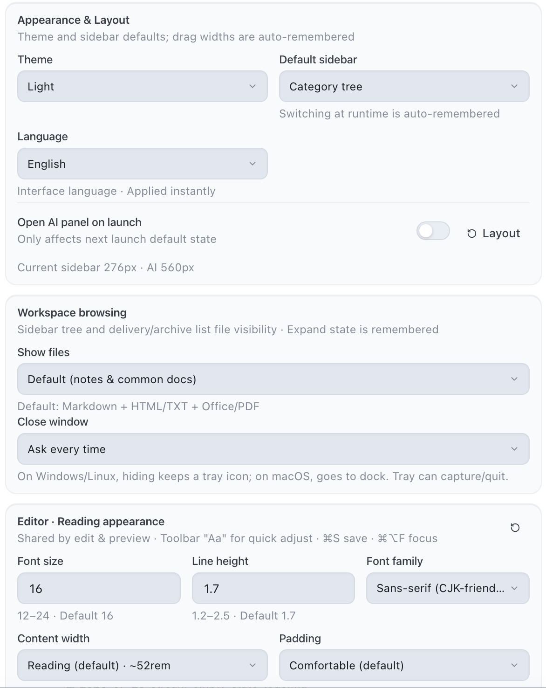
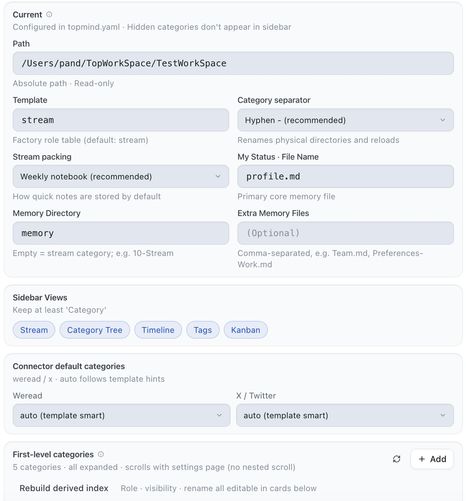
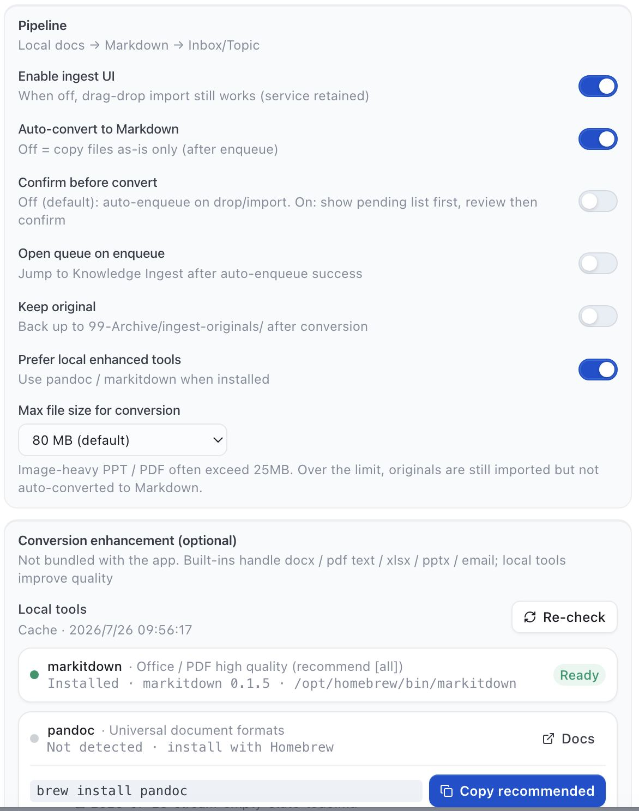
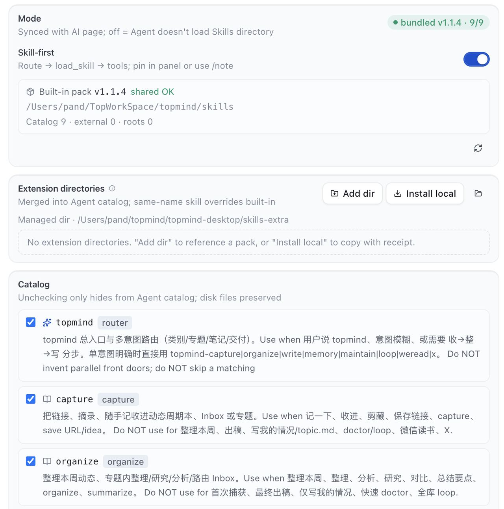
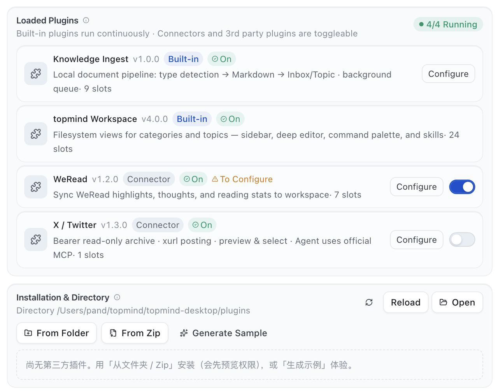
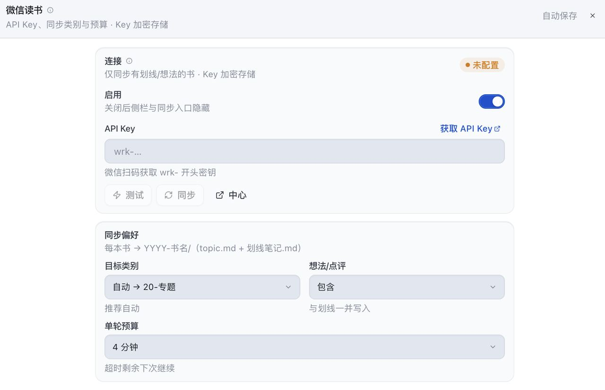

# topmind Desktop

> 本地优先**富工作台** — 动态流 · 深度编辑 · AI 副驾 · 可逆写回。  
> **版本真源：** 本目录 [`package.json`](./package.json)（`npm run versions`）。  
> **内容真源：** 始终是**工作区文件夹**；不硬依赖 UTR。  
> 用户概念 ≤5：**记一下 · 动态 · 专题 · 我的情况 · 写出来**  
> 工作流：`收进来 -> 继续做 -> 交付/沉淀 -> 找回/调整`

[产品总览](../README.md) · IA / 像素：[`DESIGN.md`](./DESIGN.md) · 架构：[`ARCHITECTURE.md`](./ARCHITECTURE.md) · 实施锁：[`../docs/ARCHITECTURE-RESET.md`](../docs/ARCHITECTURE-RESET.md)

---

## 为什么选 Desktop

| 痛点 | 怎么帮 |
|------|--------|
| 灵感没空分类 | ⌘N / ⌘⇧N → 默认**本周动态** |
| Office / PDF 散落 | 拖入**知识加工**队列 |
| 润色要切聊天 | **行内 AI** + 侧栏 Agent（结果已清洗） |
| 换工具丢格式 | 纯 Markdown · 文件自由 |

1. **动态优先导航** — 概念不堆砌；收件箱 / 写出来 / 我的情况清晰可达  
2. **Quiet Paper** — 字号 / 行距 / 栏宽 / 纸张 · 专注 ⌘⌥F  
3. **AI 副驾** — skill-first · `auto | confirm` 写回 · 建议默认可生成、确认后执行  
4. **多源加工** — Word · PDF · Excel · PPT · 邮件 → Markdown  
5. **可组合** — 与 Skills / 剪藏扩展 / 可选 UTR 共享内容约定，无强制运行时绑定  

---

## 界面导览

截图经压缩导出；下列宽度约束便于 GitHub / IDE 预览（源图见 [`resources/img/`](./resources/img/)，文档图见 [`../docs/images/`](../docs/images/README.md)）。

### 1. 工作台 · 动态

默认三栏：**导航 · 内容 · AI**。主叙事是动态流。

<p align="center">
  
</p>

<p align="center">
  
</p>

### 2. 收进来

<table>
  <tr>
    <td align="center" width="50%">
      <br/>
      <sub><b>收件箱</b> — 整理未归类条目</sub>
    </td>
    <td align="center" width="50%">
      <br/>
      <sub><b>智能识别 / 抓取</b> — 链接 · 附件 · 速记</sub>
    </td>
  </tr>
  <tr>
    <td align="center" colspan="2">
      <br/>
      <sub><b>知识加工 Hub</b> — 文档入队 · 转换 · 提交</sub>
    </td>
  </tr>
</table>

| 入口 | 行为 |
|------|------|
| ⌘N | 应用内捕获层 |
| ⌘⇧N | 全局浮窗（笔记 / 链接 / 附件） |
| 拖放到主窗 / Hub | 文档路径入队 |
| 浮窗附件提交 | 小窗内可见队列，可跳转主窗 Hub |

### 3. 继续做 · AI 待办 · Memory · 建议 · 交付

<p align="center">
  
</p>

| 入口 | 作用（单一心智） |
|------|------------------|
| 顶栏 **记一下** ⌘N | **唯一**完整捕获（笔记 / 链接 / 附件） |
| 动态 **记下** | 把输入框追加到本周周期本 |
| 动态 **AI 润色** | 只改输入框 · 不落盘 |
| 动态 **完整捕获**（文字链） | 等同顶栏「记一下」（链接/附件时用） |
| 动态 / 侧栏 ✨ **AI 待办** | 提取待办 · 检测完成 · 更新状态（⌘⇧T） |
| AI 面板 **ActionBar** | 建议 + 待确认写入；确认后写闸 |
| 侧栏 **我的情况** | Memory（profile / 周期沉淀） |

> 动态页头**不再**重复「记一下」主按钮，避免与顶栏 CTA 抢注意力。

<table>
  <tr>
    <td align="center" width="55%">
      <br/>
      <sub><b>行内 AI</b> — 润色 / 扩写 / 总结；应用前预览；<b>不含思考标签</b></sub>
    </td>
    <td align="center" width="45%">
      <br/>
      <sub><b>侧栏 Agent</b> — skill · 建议条 · 待确认写入</sub>
    </td>
  </tr>
  <tr>
    <td align="center" colspan="2">
      <br/>
      <sub><b>写出来</b> — 交付物进 <code>88-输出/</code></sub>
    </td>
  </tr>
</table>

- **阅读 Aa**：字号 / 行距 / 字族 / 栏宽 / 边距 / 纸张（编辑 = 预览）  
- **行内 AI / 动态润色**：`ai.complete`（`action: "polish"` 等）· 结果清洗后再展示  
- **Agent**：`load_skill` · 写回 auto/confirm · ActionBar（建议 + 待确认写入）  
- **待办**：`memory/todo.md` · 写闸 · AI maintain（extract / detect done / force）  
- 专注模式 ⌘⌥F · 多标签 / 单标签  

### 4. 设置

<table>
  <tr>
    <td align="center" width="33%">
      <br/>
      <sub>通用 · 主题 · 写回 · Clip</sub>
    </td>
    <td align="center" width="33%">
      <br/>
      <sub>工作区 · 类别角色</sub>
    </td>
    <td align="center" width="33%">
      <br/>
      <sub>知识加工 · 转换器</sub>
    </td>
  </tr>
  <tr>
    <td align="center" width="33%">
      <br/>
      <sub>Skills · 模型 · 密钥</sub>
    </td>
    <td align="center" width="33%">
      <br/>
      <sub>插件槽位</sub>
    </td>
    <td align="center" width="33%">
      <br/>
      <sub>微信读书连接器</sub>
    </td>
  </tr>
</table>

---

## 心智模型

```text
收进来 → 继续做 → 交付/沉淀 → 找回/调整
```

```text
~/topmind/
├── topmind-workspace/     # 内容真源（用户数据）
└── topmind-desktop/       # runtime（state / plugins / logs）
```

- 类别 + 专题：[`../PROJECT-MODEL.md`](../PROJECT-MODEL.md)  
- AI skill-first：引擎 `skills/` + 可选 `skills-extra/`  
- AI 供应商：OpenAI · Anthropic · Google · xAI · DeepSeek · Moonshot · Zhipu · MiniMax · Ollama（本地）· Custom；models.dev 社区目录预览  
- 四体边界：[`../PRODUCT-BOUNDARIES.md`](../PRODUCT-BOUNDARIES.md)  

---

## 国际化

- 默认 `auto`：按 OS / `navigator.language` 匹配 `zh-CN` 或 `en-US`  
- 主窗与 `CaptureSurface` 浮窗同步切换  
- 语言包：`src/locales/{zh-CN,en-US}/`  

---

## 开发

```bash
# 本目录
npm run dev
npm run check:quality    # 完整质量门

# 仓库根
npm run desktop:dev
npm run desktop:quality
npm run desktop:pack:mac # 或 :linux / :win
```

| 文档 | 用途 |
|------|------|
| [`DESIGN.md`](./DESIGN.md) | 产品交互 · 行内 AI 对抗场景 |
| [`ARCHITECTURE.md`](./ARCHITECTURE.md) | RPC · 服务 · AI 管线 |
| [`PLUGIN.md`](./PLUGIN.md) | 插件槽位 |
| [`../docs/PACKAGING.md`](../docs/PACKAGING.md) | 打包与安装包命名 |

返回总览：[`../README.md`](../README.md)
